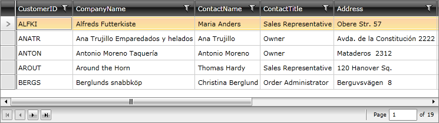

# Paging through RadDataPager

If you bind __RadDataPager.Source__ to __RadDataServiceDataSource.DataView__, you will get automatic server-side paging. The two controls will automatically communicate with each other thanks to the __IPagedCollectionView__ interface which both respect:


```XAML

	<Grid x:Name="LayoutRoot" Background="White">
	 <Grid.RowDefinitions>
	  <RowDefinition Height="*"/>
	  <RowDefinition Height="Auto"/>
	 </Grid.RowDefinitions>
	 <telerik:RadDataServiceDataSource Name="customersDataSource" QueryName="Customers" AutoLoad="True">
	  <telerik:RadDataServiceDataSource.DataServiceContext>
	   <local:MyNorthwindContext/>
	  </telerik:RadDataServiceDataSource.DataServiceContext>
	 </telerik:RadDataServiceDataSource>
	 <telerik:RadGridView Grid.Row="0" ItemsSource="{Binding DataView, ElementName=customersDataSource}" 
	     IsBusy="{Binding IsBusy, ElementName=customersDataSource}" 
	     ShowGroupPanel="False"/>  
	 <telerik:RadDataPager Grid.Row="1" Source="{Binding DataView, ElementName=customersDataSource}" PageSize="10"/>
	</Grid>
```

In this case on running the application the following will be visualized:

