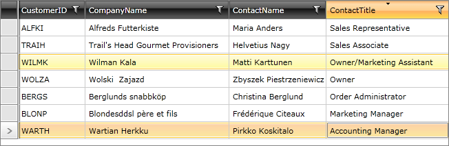

# Programmatic Sorting

Programmatic sorting is performed by adding a __SortDescriptor__ object to the __SortDescriptors__ collection of the control. 

For example: 

#### __C#__

```C#

	SortDescriptor sd = new SortDescriptor();
	sd.Member = "ContactTitle";
	sd.SortDirection = ListSortDirection.Descending;
	this.customersDataSource.SortDescriptors.Add(sd);
```

#### __VB.NET__

```VB.NET

	Dim sd As New SortDescriptor()
	sd.Member = "ContactTitle"
	sd.SortDirection = ListSortDirection.Descending
	Me.customersDataSource.SortDescriptors.Add(sd)
```

Once the application is loaded, the __RadGridView__ will be visualized as follows:


>caution Adding several __SortDescriptors__ to the collection will perform the sorting in the respective order.