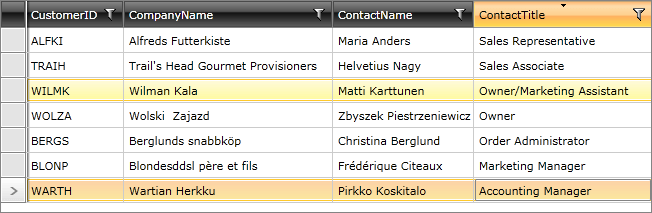

# Programmatic Sorting

Programmatic sorting is performed by adding a __SortDescriptor__ object to the __SortDescriptors__ collection of the control. 

For example: 

<snippet id='raddataservicedatasource-sorting-programmatic-sorting-block_1-cs' />

<snippet id='raddataservicedatasource-sorting-programmatic-sorting-block_1-vb' />

Once the application is loaded, the __RadGridView__ will be visualized as follows:

>caution Adding several __SortDescriptors__ to the collection will perform the sorting in the respective order.