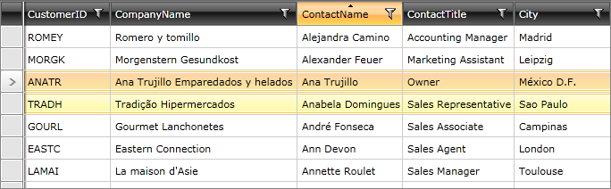

# Sorting through RadGridView

## 

If you bind __RadGridView.ItemsSource__ to __RadDataServiceDataSource.DataView__, you will get automatic server-side sorting. When the user defines his sorting criteria through __RadGridView’s__ UI, __RadGridView__ will automatically transfer the resulting __SortDescriptors__ to __RadDataServiceDataSource__. If __RadDataServiceDataSource.AutoLoad__ is ___true___, the control will automatically go to the server and get the ordered data. 

>caution If __AutoLoad__ is ___false___, the descriptors will be transferred to __RadDataServiceDataSource__, but no trip to the server will be made until the __Load__ method is called.