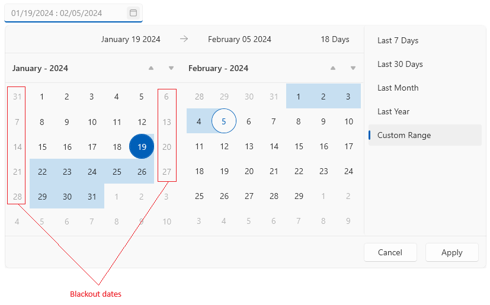

# Blackout Dates

The blackout dates feature of the DateRangePicker component allows you to define a set of dates that will be disabled and the user cannot select them.

The list of disabled dates is assigned through the `BlackoutDates` property of `RadDateRangePicker`. The property expects a collection of `DateTime` objects.

__Blackout the weekends of the current month__
```C#
	var weekends = new ObservableCollection<DateTime>();
	var daysInMonth = DateTime.DaysInMonth(DateTime.Today.Year, DateTime.Today.Month);
	var startDate = new DateTime(DateTime.Today.Year, DateTime.Today.Month, 1);
	for (int i = 0; i < daysInMonth; i++)
	{
		var currentDate = startDate.AddDays(i);
		if (currentDate.DayOfWeek == DayOfWeek.Saturday || currentDate.DayOfWeek == DayOfWeek.Sunday)
		{
			weekends.Add(currentDate);
		}
	}
	this.dateRangePicker.BlackoutDates = weekends;
```



## See Also
* [Getting Started]()
* [Selection]()