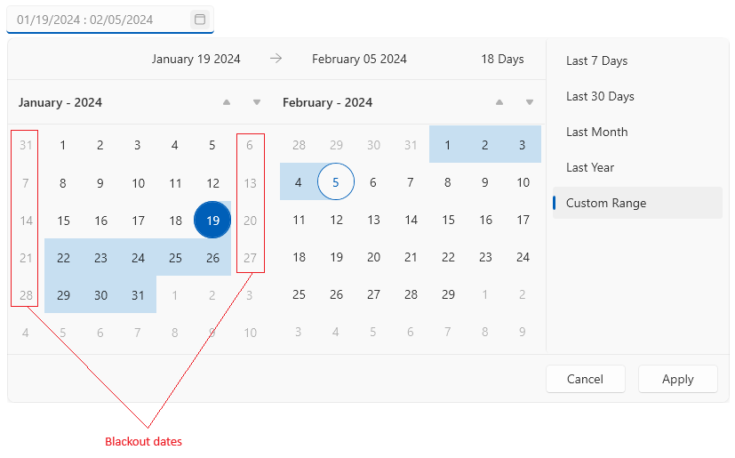

# Blackout Dates

The blackout dates feature of the DateRangePicker component allows you to define a set of dates that will be disabled and the user cannot select them.

The list of disabled dates is assigned through the `BlackoutDates` property of `RadDateRangePicker`. The property expects a collection of `DateTime` objects.

__Blackout the weekends of the current month__
<snippet id='raddaterangepicker-blackout-dates-blackout_the_weekends_of_the_current_month-cs' />

## See Also
* [Getting Started]()
* [Selection]()