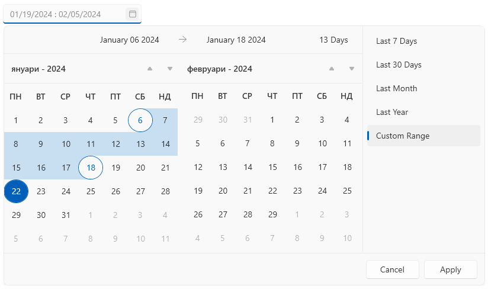
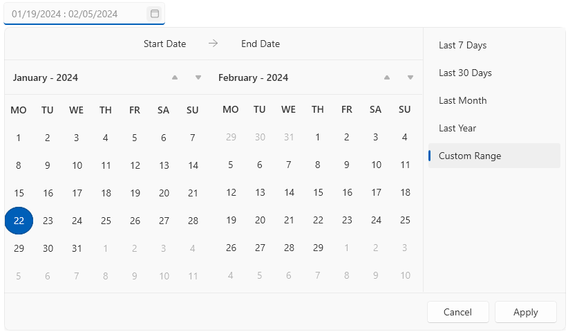

# Culture Settings

The DateRangePicker control has a built-in localization mechanism that allows you to change the culture and language settings of the control.

The common [Localization]() article describes the localization support in more details. Additional to that, `RadDateRangePicker` comes with few extra properties that can be used to adjust the culture settings.

## Setting the Culture

The current culture of the control describes how the DateTime values will be formatted in the calendars. To change the culture, set the `Culture` property of `RadDateRangePicker`.

#### __[C#] Setting Bulgarian culture__
{{region raddaterangepicker-culture-settings-0}}
	this.dateRangePicker.Culture = new System.Globalization.CultureInfo("bg-BG");
{{endregion}}

## Setting the First Day of the Week

To change the first day of the week displayed in the calendars, set the `FirstDayOfWeek` property of `RadDateRangePicker`.

#### __[XAML] Setting Monday as the first day of the week__
{{region raddaterangepicker-culture-settings-1}}
	 <telerik:RadDateRangePicker FirstDayOfWeek="Monday" AreWeekNamesVisible="True" />                             
{{endregion}}

## Setting the First Week of the Year Rule

To define when the first week of the year in the calendars should start, set the `CalendarWeekRule` property of `RadDateRangePicker`. The property is of type `CalendarWeekRule` and exposes the following values:

* `FirstDay`&mdash;The first week of the year starts on the first day of the year and ends before the following designated first day of the week.
* `FirstFullWeek`&mdash;The first week of the year begins on the first occurrence of the designated first day of the week on or after the first day of the year.
* `FirstFourDayWeek`&mdash; The first week of the year is the first week with four or more days before the designated first day of the week.

#### __[XAML] Setting the first week of the year rule__
{{region raddaterangepicker-culture-settings-2}}
	  <telerik:RadDateRangePicker CalendarWeekRule="FirstFullWeek"/>
{{endregion}}

## See Also  
* [Getting Started]()
* [Localization]()
