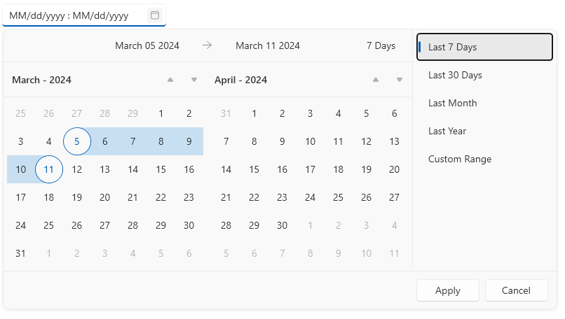
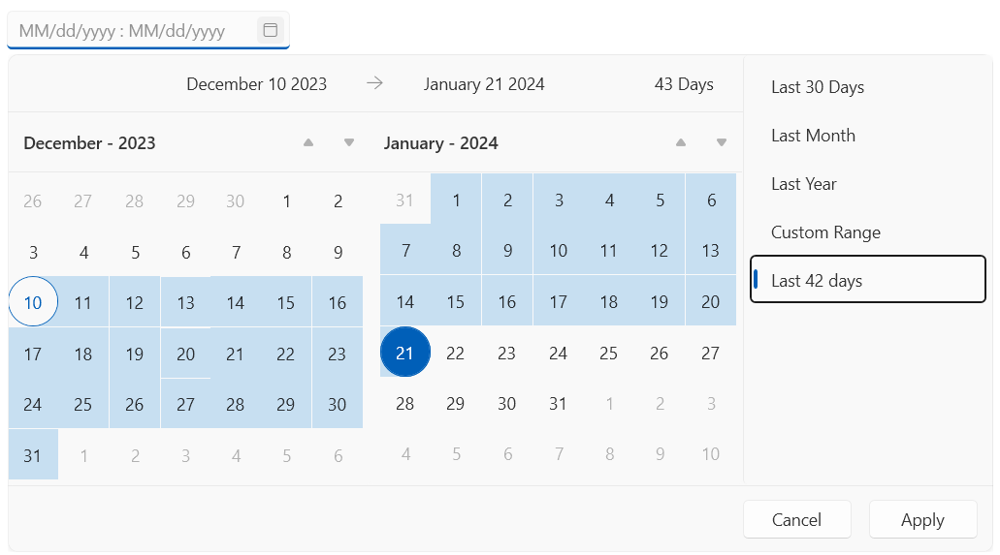
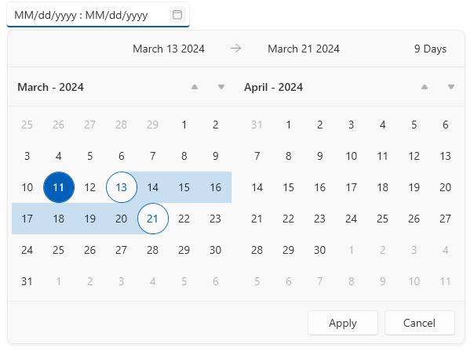

# Custom Date Ranges

The custom ranges are a set of pre-defined date spans displayed next to the calendars of the DateRangePicker component. The set can be used to easily select a specific time span.

The `RadDateRangePicker` control has the following built-in ranges, that can be customized or removed with the `CustomRangesLoadingEventArgs` event.

* __Last 7 Days__
* __Last 30 Days__
* __Last Month__
* __Last Year__



__Adding and removing ranges in the CustomRangesLoadingEventArgs event handler__
```C#
	private void RadDateRangePicker_CustomRangesLoading(object sender, CustomRangesLoadingEventArgs e)
	{
		// removes the first predefined range
		e.CustomRanges.RemoveAt(0);

		// adds a new custom range
		var newRange = new CustomRange("Last 42 days")
		{
			StartDate = DateTime.Today.AddDays(-42),
			EndDate = DateTime.Today
		};
		e.CustomRanges.Add(newRange);
	}
```



## Hiding the Date Ranges Panel

To hide the date ranges from the UI, set the `IsDefaultRangesPanelVisible` property of `RadDateRangePicker` to `false`.

__Hiding the date ranges panel__
```C#
	<telerik:RadDateRangePicker IsDefaultRangesPanelVisible="False" />
```



## See Also
* [Getting Started]()
* [Events]()
