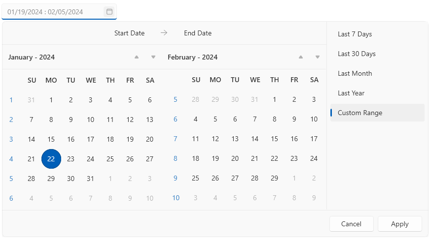
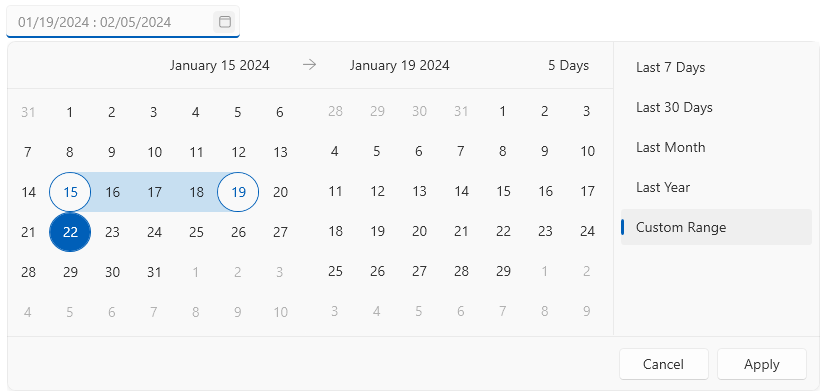
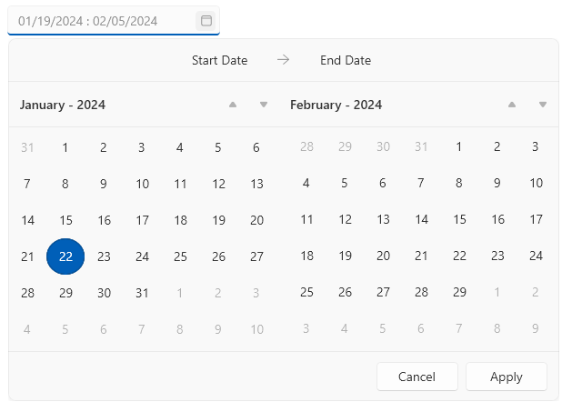

# Customizing Appearance

DateRangePicker provides several properties that can be used to customize its appearance.

## Showing Week Names and Numbers in the Calendar

By default the calendars in the drop down display only the day numbers, but the week number and dates can be shown as well. To do that, use the `AreWeekNamesVisible`  and `AreWeekNumbersVisible` properties of `RadDateRangePicker`.

__Setting the AreWeekNumbersVisible and AreWeekNamesVisible properties__
```XAML
	<telerik:RadDateRangePicker AreWeekNamesVisible="True" AreWeekNumbersVisible="True" />
```



## Customizing the Clear Button

The clear button is displayed on hover of the text input area. The button can be hidden by setting the `IsClearButtonVisible` property the of `RadDateRangePicker` to `false`.

__Setting the IsClearButtonVisible property__
```XAML
	<telerik:RadDateRangePicker IsClearButtonVisible="False"/>
```

To further customize the button, use the `ClearButtonStyle` property. The property expects a `Style` object with its target type set to `RadButton`.

__Using the ClearButtonStyle property__
```XAML
	<Grid>
		<!-- if you use the NoXaml dlls and the Implicit Styles theming mechanism you don't need this ResourceDictionary -->
		<Grid.Resources>
			<ResourceDictionary Source="/Telerik.Windows.Controls.Input;component/Themes/GenericWindows11.xaml"/>
		</Grid.Resources>
		
		<telerik:RadDateRangePicker>
			<telerik:RadDateRangePicker.ClearButtonStyle>
				<Style TargetType="telerik:RadButton" BasedOn="{StaticResource DateRangeMaskedInputClearButtonStyle}">
					<Setter Property="Foreground" Value="White"/>
					<Setter Property="Background" Value="Purple"/>
					<Setter Property="Padding" Value="10"/>
				</Style>
			</telerik:RadDateRangePicker.ClearButtonStyle>
		</telerik:RadDateRangePicker>
	</Grid>
```


## Hiding the Top Bar and Header

The top bar visual in the drop down displays the selected dates and their total number. To hide the top bar, set the `IsTopBarVisible` property of `RadDateRangePicker` to `false`.

__Setting the IsTopBarVisible property__
```XAML	
	<telerik:RadDateRangePicker IsTopBarVisible="False"/>
```


The header visuals in the drop down display the current view (month or year) of each calendar, along with the arrow buttons for changing the current view range. To hide the headers, set the `HeaderVisibility` property of `RadDateRangePicker` to `Collapsed` or `Hidden`.

__Setting the HeaderVisibility property__
```XAML	
	<telerik:RadDateRangePicker HeaderVisibility="Collapsed"/>
```



## Hiding the Custom Ranges Panel

The custom ranges panel is displayed next to the calendars in the drop down. To hide this panel, set the `IsDefaultRangesPanelVisible` property of `RadDateRangePicker`.

__Setting the IsDefaultRangesPanelVisible property__
```XAML	
	<telerik:RadDateRangePicker IsDefaultRangesPanelVisible="False"/>
```



## See Also  
* [Text Input Formatting]()
* [Getting Started]()