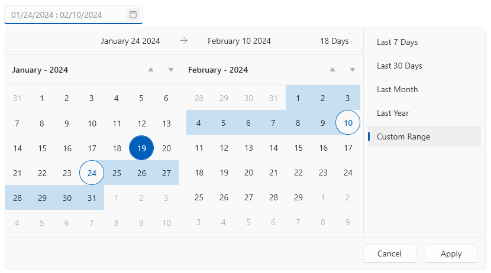

# DateRangePicker Overview

The DateRangePicker component allows you to easily enrich your UI with a tool for selecting range of dates. This is helpful for scenarios where you need to extract a specific set of data related to a time range. For example, applications for booking hotels, showing graphs with sales data in specific ranges and more. 





## Key Features

* __Culture settings__&mdash;RadDateRangePicker provides settings to adjust the current culture and few corresponding options, like the first day of the week.

* __Read-only support__&mdash;The component can be displayed in a read-only state that disables the user selection of dates.

* __Allowed selection range__&mdash;You can define an allowed selection range which restricts the user selection.

* __Blackout dates__&mdash;This features can be used to disable a set of dates which cannot be selected.

* __Customizable input element__&mdash;The DateRangePicker control allows you to customize the format and placeholders of the input area.

* __Customizable calendars__&mdash;The control has a set of two calendars that show the current and next month or year, which can be customized via number of properties of the control. 

>tip Get started with the control with its [Getting Started]() help article that shows how to use it in a basic scenario.

>Check out the DateRangePicker demos at: [https://demos.telerik.com/wpf/](https://demos.telerik.com/wpf/)

## Telerik UI for WPF Support and Learning Resources

* [Telerik UI for WPF DateRangePicker Homepage](https://www.telerik.com/products/wpf/daterangepicker.aspx)
* [Get Started with the Telerik UI for WPF DateRangePicker]()
* [Telerik UI for WPF API Reference](https://docs.telerik.com/devtools/wpf/api/)
* [Getting Started with Telerik UI for WPF Components]()
* [Telerik UI for WPF Virtual Classroom (Training Courses for Registered Users)](https://learn.telerik.com/learn/course/external/view/elearning/16/telerik-ui-for-wpf) 
* [Telerik UI for WPF DateRangePicker Forums](https://www.telerik.com/forums/wpf)
* [Telerik UI for WPF Knowledge Base](https://docs.telerik.com/devtools/wpf/knowledge-base)

## See Also  
* [Visual Structure]()
* [Getting Started]()
