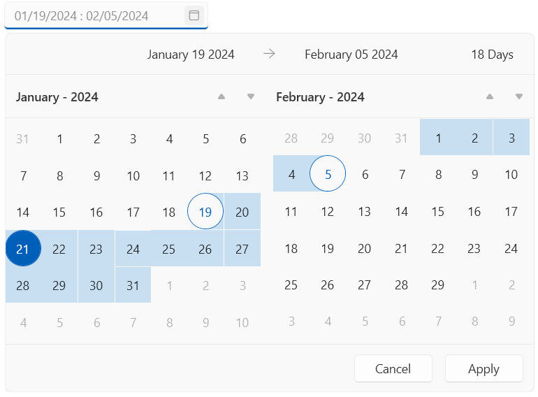
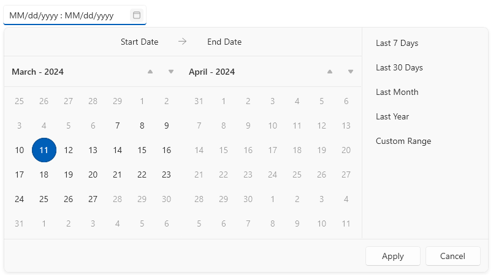

# Programmatic Selection

The date range can be selected through the UI or via the available API of the DateRangePicker component.

The selection can be assigned manually via the `StartDate` and `EndDate` properties of `RadDateRangePicker`.

__Setting the selection range in XAML__
```XAML
	<telerik:RadDateRangePicker StartDate="2024/1/19" EndDate="2024/2/5" />
```

__Setting the selection range in C#__
```XAML
	this.dateRangePicker.StartDate = new DateTime(2024, 1, 19);
	this.dateRangePicker.EndDate = new DateTime(2024, 2, 5);
```



## Defining Available Selection Range

The dates available for selection can be limited via the `SelectableDateStart` and `SelectableDateEnd` properties of `RadDateRangePicker`. Setting this will disable all other dates in the calendars.

__Setting the selection range in XAML__
```XAML
	<telerik:RadDateRangePicker SelectableDateStart="2024/3/7" SelectableDateEnd="2024/3/27" />
```

__Setting the selection range in C#__
```XAML
	this.dateRangePicker.SelectableDateStart = new DateTime(2024, 3, 7);
	this.dateRangePicker.SelectableDateEnd = new DateTime(2024, 3, 27);
```



> To disable a specific set of dates, you can use the [blackout dates]() feature.

## Text Selection Action on Focusing the Input Element

By default when you click into the text input element that shows the selected dates, all text gets selected. The DateRangePicker control allows you to alter this behavior via a set of actions that can be applied using the `SelectionOnFocus` enum property. The property allows the following values:

* `Unchanged`&mdash;When the text input is focused the selection won't be modified.
* `SelectAll`&mdash;When the text input is focused, all text gets selected.
* `CaretToBeginning`&mdash;When the text input is focused, the cursor is placed in the beginning of the text.
* `CaretToEnd`&mdash;When the text input is focused, the cursor is placed in the end of the text.
* `Default`&mdash;When the text input is focused the caret will be placed at the beginning if the text is still not set. Otherwise the position of the cursor won't be changed.
* `DefaultSelectAll`&mdash;This behavior behaves like `SelectAll` if the control is focused with a mouse click action. If the text input is focused with the `Tab` key, the behavior is like with the `Default` mode.

## See Also
* [Getting Started]()
* [Events]()
