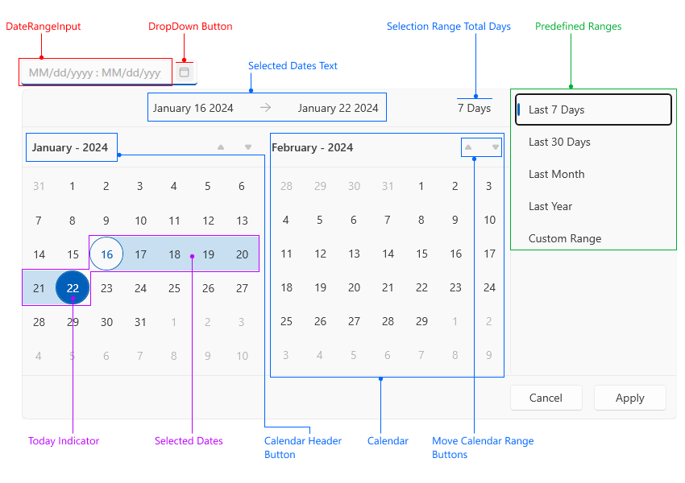

# Visual Structure

This section defines terms and concepts used in the scope of `RadDateRangePicker` that you need to get familiar with prior to continue reading this help. They can also be helpful when contacting our support service in order to describe your issue better. Below you can see snapshots and explanations of the main states and visual elements of the standard `RadDateTimePicker` control.        

* __Date Range Input__&mdash;Textbox input that displays the selection range.

* __Drop Down Button__&mdash;Button that opens the drop down with the calendars.

* __Selected Dates Text__&mdash;Text area that displays the from/to dates range.

* __Selection Range Total Days__&mdash;The total number of selected days.

* __Predefined Ranges__&mdash;List of predefined ranges that allows easier selection of commonly used ranges.

* __Today Indicator__&mdash;Indicator that shows the current day.

* __Selected Dates__&mdash;Highlight that shows the current selection.

* __Calendar Header Button__&mdash;Button that displays the current month or year. It can be pressed to change the current calendar view.

* __Calendar__&mdash;Calendar showing the dates. There are two calendars in the control placed next to each other - one for the current month and one for the next month.

* __Move Calendar Range Buttons__&mdash;Buttons that change the current range of the calendar.

## See Also
 * [Getting Started]()