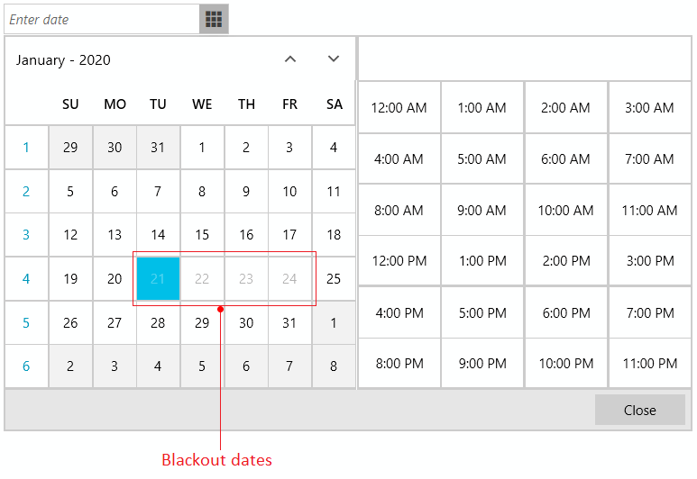

# Blackout Dates

RadDateTimePicker allows you to disable certain dates in the [calendar part]() of the control. To do this, set the __BlackoutDates__ property of RadDateTimePicker to a collection of DateTime objects.

>tip RadDateTimePicker control uses RadCalendar to show its calendar. The feature shown in this article is the same as the [blackout dates of RadCalendar]().

>important In order for a date from the BlackoutDates collection to get disabled in the calendar, its time portion should be set to the start of the day (usually `00:00:00.00` which is 12:00:00AM). Otherwise, the date won't get reflected in the UI.

## Setting BlackoutDates

This section shows how to set the BlackoutDates in code behind.

#### __[XAML] Example 1: Defining RadDateTimePicker__
{{region raddatetimepicker-features-blackoutdates-0}}
	<telerik:RadDateTimePicker x:Name="radDateTimePicker" />
{{endregion}}

#### __[C#] Example 2: Setting the BlackoutDates property in code behind__
{{region raddatetimepicker-features-blackoutdates-1}}	
	public MainWindow()
	{		
		InitializeComponent();

		DateTime startDate = DateTime.Today; // note that this will return a date with its hours set to the start of the day (00:00:00). Example: 21.01.2020 00:00:00.00
		var blackoutDates = new ObservableCollection<DateTime>()
		{
			startDate,
			startDate.AddDays(1),
			startDate.AddDays(2),
			startDate.AddDays(3),
		};
		this.radDateTimePicker.BlackoutDates = blackoutDates;
	}
{{endregion}}

#### __[VB.NET] Example 2: Setting the BlackoutDates property in code behind__
{{region raddatetimepicker-features-blackoutdates-2}}	
	Public Sub New()
	    InitializeComponent()
	    Dim startDate As DateTime = DateTime.Today
	    Dim blackoutDates = New ObservableCollection(Of DateTime)() From {
		startDate,
		startDate.AddDays(1),
		startDate.AddDays(2),
		startDate.AddDays(3)
	    }
	    Me.radDateTimePicker.BlackoutDates = blackoutDates
	End Sub
{{endregion}}

## Data Binding BlackoutDates

This section shows how to data bind the BlackoutDates property.

#### __[C#] Example 3: Setting up the model__
{{region raddatetimepicker-features-blackoutdates-3}}
	public class MainViewModel
    {
        public ObservableCollection<DateTime> BlackoutDates { get; set; }

        public MainViewModel()
        {
            DateTime startDate = DateTime.Today; // note that this will return a date with its hours set to the start of the day (00:00:00). Example: 21.01.2020 00:00:00.00
            this.BlackoutDates = new ObservableCollection<DateTime>()
            {
                startDate,
                startDate.AddDays(1),
                startDate.AddDays(2),
                startDate.AddDays(3),
            };
        }
    }
{{endregion}}

#### __[VB.NET] Example 3: Setting up the model__
{{region raddatetimepicker-features-blackoutdates-4}}
	Public Class MainViewModel
		Public Property BlackoutDates As ObservableCollection(Of DateTime)

		Public Sub New()
			Dim startDate As DateTime = DateTime.Today
			Me.BlackoutDates = New ObservableCollection(Of DateTime)() From {
			    startDate,
			    startDate.AddDays(1),
			    startDate.AddDays(2),
			    startDate.AddDays(3)
			}
		End Sub
	End Class
{{endregion}}

#### __[C#] Example 4: Setting the data context__
{{region raddatetimepicker-features-blackoutdates-5}}
	public MainWindow()
	{		
		InitializeComponent();
		this.DataContext = new MainViewModel();		
	}
{{endregion}}

#### __[VB.NET] Example 4: Setting the data context__
{{region raddatetimepicker-features-blackoutdates-6}}
	Public Sub New()
		InitializeComponent()
		Me.DataContext = New MainViewModel()
	End Sub
{{endregion}}

#### __[XAML] Example 5: Data binding the BlackoutDates property__
{{region raddatetimepicker-features-blackoutdates-4}}
	<telerik:RadDateTimePicker BlackoutDates="{Binding BlackoutDates}" />
{{endregion}}

>tip Find a runnable project that demonstrates how to use BlackoutDates in the [online SDK repository](https://github.com/telerik/xaml-sdk/tree/master/DateTimePicker/AllowedDates).
