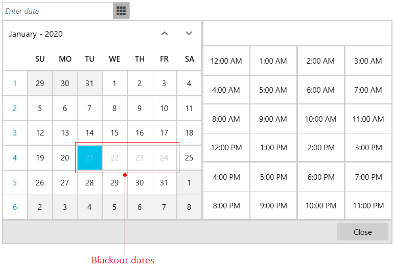

# Blackout Dates

RadDateTimePicker allows you to disable certain dates in the [calendar part]() of the control. To do this, set the __BlackoutDates__ property of RadDateTimePicker to a collection of DateTime objects.

>tip RadDateTimePicker control uses RadCalendar to show its calendar. The feature shown in this article is the same as the [blackout dates of RadCalendar]().

>important In order for a date from the BlackoutDates collection to get disabled in the calendar, its time portion should be set to the start of the day (usually `00:00:00.00` which is 12:00:00AM). Otherwise, the date won't get reflected in the UI.

## Setting BlackoutDates

This section shows how to set the BlackoutDates in code behind.

__Example 1: Defining RadDateTimePicker__
<snippet id='raddatetimepicker-features-blackoutdates-example_1_defining_raddatetimepicker-xaml' />

__Example 2: Setting the BlackoutDates property in code behind__
<snippet id='raddatetimepicker-features-blackoutdates-example_2_setting_the_blackoutdates_property_in_code_behind-cs' />

<snippet id='raddatetimepicker-features-blackoutdates-example_2_setting_the_blackoutdates_property_in_code_behind-vb' />

## Data Binding BlackoutDates

This section shows how to data bind the BlackoutDates property.

__Example 3: Setting up the model__
<snippet id='raddatetimepicker-features-blackoutdates-example_3_setting_up_the_model-cs' />

<snippet id='raddatetimepicker-features-blackoutdates-example_3_setting_up_the_model-vb' />

__Example 4: Setting the data context__
<snippet id='raddatetimepicker-features-blackoutdates-example_4_setting_the_data_context-cs' />

<snippet id='raddatetimepicker-features-blackoutdates-example_4_setting_the_data_context-vb' />

__Example 5: Data binding the BlackoutDates property__
<snippet id='raddatetimepicker-features-blackoutdates-example_5_data_binding_the_blackoutdates_property-xaml' />

>tip Find a runnable project that demonstrates how to use BlackoutDates in the [online SDK repository](https://github.com/telerik/xaml-sdk/tree/master/DateTimePicker/AllowedDates).
