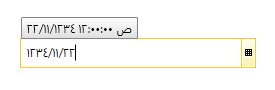

# Calendar Support

As of **R1 2017** RadDateTimePicker can display and parse dates from all .NET Framework calendar implementations.

>A full list of the supported calendars as well as an example of how to set their culture can be found in [the respective RadCalendar article]().

**Figure 1** demonstrates the parsing of DateTime values for the Hijri calendar.

#### __Figure 1: Hijri dates parsing__

>For more information on how to use the calendar classes when working with date values, please read the following [MSDN article](https://msdn.microsoft.com/en-us/library/82aak18x).

## See Also

* [Parsing Without Separators]()

* [Military DateTime Parsing]()