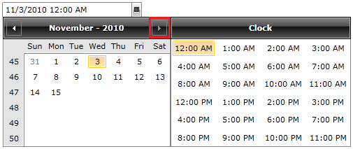
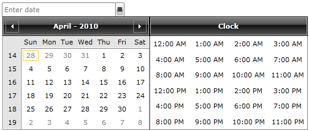

# Date Items

When you use the __RadDateTimePicker__ control you can customize the date items included in the __Calendar__ view. You can define start and end dates for the entries in the calendar. You do this using the following properties:

* __DisplayDateStart__ - it is of type __DateTime__ and represents the starting date of the date items in your __Calendar__.

* __DisplayDateEnd__ - it is again of type __DateTime__ and represents the ending date of the items in your __Calendar__.

If you specify these properties you will be able to select a date only in the range of the chosen start and end dates.

Here is an example of setting these properties in XAML:

#### __XAML__

```XAML
	<telerik:RadDateTimePicker DisplayDateStart="1/1/2010" DisplayDateEnd="11/15/2010"/>
```

Here is the result:



The Next Month button is not active because of the __DisplayDateEnd__ property's value set in the example.

>tipYou can further restrict the input by indicating a selectable start and end dates. These dates will allow you to select only within a predefined range, but you would still have the ability to browse within the range of the display start and end dates. [Read more here]()

## Using a default display date

You can also set the default date visible when the calendar appears. The property you have to use is called __DisplayDate__ and is of type __DateTime__. 

>Notice that the __DisplayDate__ is different from the __SelectedDate__ property. The __DisplayDate__ points out just the default month and year visible when the calendar first pops up, nothing is selected. 

For example:

#### __XAML__

```XAML
	<telerik:RadDateTimePicker DisplayDate="4/1/2010"/>
```

The result of this example will be that when you click on the __RadDateTimePicker's__ drop-down button for the first time in the calendar you will not see the current month and year but instead the month and year defined in the __DisplayDate__ property.



>tipIf you set the __DisplayDate__ property to a value which is not in the range of the __DisplayDateStart__ and __DisplayDateEnd__ properties you will end up with a parse error exception.

## See Also

 * [Overview]()

 * [Visual Structure]()

 * [Clock Items]()

 * [Selection]()

 * [Formatting]()

 * [How to set the first day of the week]()
