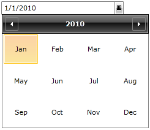

# Date Selection Modes

If you want to modify the representation of the items located in the Calendar view of your __RadDateTimePicker__ control you can use the __DateSelectionMode__ property. 

The __DateSelectionMode__ specifies whether the calendar in the __RadDateTimePicker__ control will select days, months or years. The possible values are correspondingly:

* __Day__: This is the default value and will let you select a day. Using this selection mode you can still browse the calendar - selecting the month you will go into another view where you can directly select another month. The behavior is the same for years, too. 

* __Month__: Lets you select a specific month. Using this selection mode you will limit the input to a single month only. This means that you will not be able to browse through a specific month's days. Still, the user can change the date by typing it manually.

* __Year__: Lets you select a year. This selection mode limits the input to years only, i.e. you will not be able to browse months and days from the dropdown. Still, the user can change the date by typing it manually.

>These date selection modes are only for the control's Calendar view and don't refer in any way to the Clock view. The default __RadDateTimePicker__ control will include both of the views and if you prefer to have only one of them you can do that by changing the control's input mode. [Read more here.]()

You can change the value of the __DateSelectionMode__ property in XAML as shown in __Example 1__:

__Example 1: Setting the DateSelectionMode property__

```XAML
	<telerik:RadDateTimePicker x:Name="dateTimePicker" InputMode="DatePicker" DateSelectionMode="Month"/>
```

__Example 2__ demonstrates how you can change it in code.

__Example 2: Setting the DateSelectionMode property programmatically__
```C#
	public partial class MainWindow : Window
	{
		public MainWindow()
		{
			InitializeComponent();
			this.dateTimePicker.DateSelectionMode = Telerik.Windows.Controls.Calendar.DateSelectionMode.Month;
		}
	   
	}
```
```VB.NET
	public partial class MainWindow : Window
	{
		public MainWindow()
		{
			InitializeComponent();
			this.dateTimePicker.DateSelectionMode = Telerik.Windows.Controls.Calendar.DateSelectionMode.Month;
		}
	   
	}
```

This example will achieve the following:

* Remove the clock view by explicitly changing the __RadDateTimePicker's__ default input mode to DatePicker.

* Modify the date item's representation in the calendar.

Here is the result:

#### __Figure 1: DateTimePicker with selection mode set to Month__


## See Also

 * [Overview]()

 * [Visual Structure]()

 * [Input Modes]()

 * [Selection]()

 * [Formatting]()
