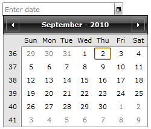
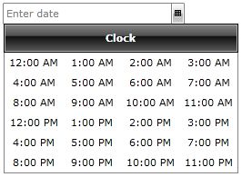

# Input Modes

This __RadDateTimePicker__ fully replaces the functionality of the __RadTimePicker__ and __RadDatePicker__ controls. When you use a __RadDateTimePicker__ control you might want to specify that you need to use the calendar or the clock independently. 

This behavior can be controlled via the __InputMode__ property. The default value gives you both the calendar and the clock views. There are three input modes that correspond to these scenarios:

* __DatePicker__ - with this input mode your __RadDateTimePicker__ control will show only the calendar view.

* __TimePicker__ - this input mode lets your __RadDateTimePicker__ control show only the clock view.

* __DateTimePicker__ - this input mode is the default one and will visualize both the calendar and the clock views.

You can change the value of this property in XAML as shown in this snippet:

#### __XAML__

```XAML
	<telerik:RadDateTimePicker InputMode="DatePicker"/>
```

Here is the result:



Similarly if you decide to have only the time picker you can choose the TimePicker input mode:

#### __XAML__

```XAML
	<telerik:RadDateTimePicker InputMode="TimePicker"/>
```

This leads to the following result:



## See Also

 * [Overview]()

 * [Visual Structure]()

 * [Date Selection Modes]()

 * [Selection]()

 * [Formatting]()
