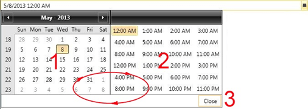

# Keyboard Support

Using the keyboard you can perform some of the most common tasks. This section describes the keyboard shortcuts used by __RadDateTimePicker__.

## Navigation between Calendar and Clock

When the user opens the DateTimePicker, the keyboard focus goes automatically to the Calendar in it. At this point, there is a full TAB cycle in the dropdown of the control, namely:

* Clicking TAB goes to Clock part of the control;

* Clicking TAB again navigates to the Close button;

* The next TAB moves the focus to the Calendar again;

* Clicking SHIFT+TAB returns to the previous element in the TAB cycle.



## Navigation inside the Calendar

When the focus is in the Calendar, you can use the following keyboard keys to navigate between the Dates and the Views:

* __Arrow Keys__ - navigate in all directions inside the Calendar;

* __Home/End__ - navigate to the first/last day of the month;            

* __PageUp/PageDown__ - navigate to the next or previous month;            

* __Ctrl & +/- or Ctrl + ArrowUp/ArrowDown__ - navigate between the Views in the Calendar (ZoomIn and ZoomOut functionality).            

* __Enter__ - selects the currently focused date and closes the dropdown.            

## Navigation inside the TimePicker

Here is a list of the keyboard shortcuts that can be used inside TimePicker:

* __Arrow Keys__ - navigate in all directions inside the TimePicker.

* __Home/End__ - navigate to the first/last item.

* __Enter__ - selects the currently focused time and closes the dropdown.

## Tab Navigation

__TabNavigationExtensions.IsTabStop__ attached property indicates whether RadDateTimePicker control is included in the tab navigation cycle. __Example 1__ illustrates how to set that property in order to exclude the control from the tab navigation. The property is available since R3 2016.  

__Example 1: RadDateTimePicker with TabNavigationExtensions.IsTabStop__

```XAML
	<telerik:RadDateTimePicker telerik:TabNavigationExtensions.IsTabStop="False" />
```
