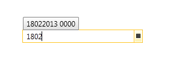
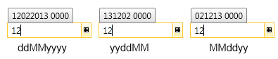
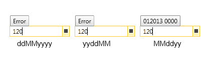
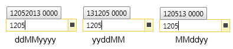
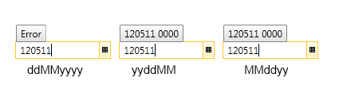

# Military DateTime Parsing

With the Q1 2013 release __RadDateTimePicker__ provides the option to parse the entered DateTime in a military format.

The ShortDatePattern and ShortTimePattern DateTimeFormats should be set in order for the military parsing to work. 

The possible Date formats are:

* ddMMyyyy

* ddMMyy

* yyMMdd

* MMddyy

* MMddyyyy

* yyyyMMdd

* yyddMM

* yyyyddMM

* MMMddyyyy

* ddMMMyyyy

>tipWhere MMM is the month with abbreviated name: MAR, JAN, FEB, etc.

The only possible Time format is:

* HHmm

So, let's have the following RadDateTimePicker:


```XAML
	<telerik:RadDateTimePicker x:Name="radDateTimePicker" Width="200" />
```

Here is how the military parsing can be set:


```C#
	this.radDateTimePicker.Culture = new System.Globalization.CultureInfo("en-US");
	this.radDateTimePicker.Culture.DateTimeFormat.ShortDatePattern = "ddMMyyyy";
	this.radDateTimePicker.Culture.DateTimeFormat.ShortTimePattern = "HHmm";
```

And the result is:



Here is in more details how the military parsing works according to the entered text:

Input	|	Output
---	|	---
"1"	|	False - the parsing expects at least 2 symbols.
"12"	|	True - sets the day in the current month and year. Here is how it looks with different ShortDate formats:<br/>
"120"	|	Depending on the format, it will try to parse it as day and month in the current year:<br/><br/>The parser works from right to left, that is why in the first two cases the result is false - it tries to parse Month=20. In the third case Day=20, so the parsing is successful.
"1205"	|	Again, depending on the format, it will try to parse it as day and month in the current year:<br/><br/>In the first two cases the parsed date is May 12, while in the third case it is December 5.
"12051"	|	False, until it fulfills the format’s length.
"120511"	|	It should be parsed depending on the date format:<br/><br/>In the first case the entered string has not reached the format's length, that's why it returns False. Note that in the second case the parsed date is November 5, 2012, while in the third case it is - December 5, 2011.
"Jan"	|	Sets the current day and year, and the month parsed.
"Jan21"	|	Should parse 21 of January, current year.

## See Also

 * [Formatting]()
