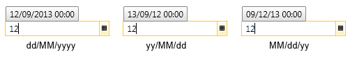
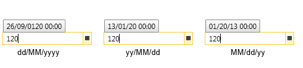
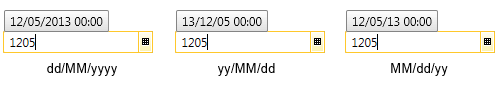
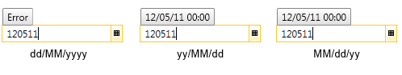
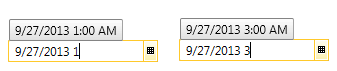
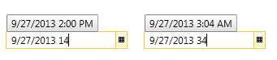
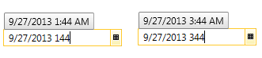

# Parsing Without Separators

__RadDateTimePicker__ provides parsing logic which allows the end users to enter dates in the input field directly without separators. This feature can be enabled by setting the __AllowParsingWithoutSeparator__ property of the control to __True__. (Its default value is __False__)

>important When this feature is enabled, the entered date will be parsed according to the [military format]() rules and you have to set the DateTimeFormats to one of the supported ones listed in the article in order for this feature to work correctly. 

__Example 1: Setting the AllowParsingWithoutSeparator in xaml__

```XAML
	<telerik:RadDateTimePicker x:Name="radDateTimePicker" AllowParsingWithoutSeparator="True" />
```

__Example 2: Setting the AllowParsingWithoutSeparator in code__

```C#
	this.radDateTimePicker.AllowParsingWithoutSeparator = true;
```
```VB.NET
	Me.radDateTimePicker.AllowParsingWithoutSeparator = True
```

__Figure 1__ shows how the entered text is handled in both cases. In the first case the text is parsed as a month and day while in the second case - as a year, since no separators are entered.

#### __Figure 1: DateTime parsing__


## Parsing the Date part

The following table lists the rules applied when using parsing without separators:

Input	|	Output
---	|	---
“1” or “12”	|	Sets the day in the month and year of the SelectedDate (if SelectedDate is null, the current month and current year are set). Here is how it looks with different formats:<br/>
“120”	|	Depending on the format, it will try to parse it as a day and month in the year of the SelectedDate (if SelectedDate is null, current year is used).<br/><br/>The parser works from right to left, in the first case it tries to parse Month=20, as this returns false, it switches to the default parser and parses it as a year. In both the second and third case the parsed date is January 20, current year.
“1205”	|	Again, depending on the format, it will try to parse it as a day and a month in the year of the SelectedDate (or current year if SelectedDate is null).<br/><br/>In the first case the parsed date is May 12, while in the second and third cases it is December 5.
“12051”	|	False, until it fulfills the format’s length.
“120511”	|	it should be parsed according to the set format:<br/><br/>In the first case the entered string has not reached the format's length, that's why it returns False. Note that in the second case the parsed date is May 11, 2012, while in the third case it is - December 5, 2011.
“Jan”	|	Sets the year and day of the SelectedDate and the month parsed.
“Jan21”	|	Sets the year of the SelectedDate and the day and month parsed.

>The DateTimePicker should match first the short abbreviations of the month names: 
Jan, Feb, Mar, Apr, May, June, July, Aug, Sept, Oct, Nov, Dec.
And then the whole word of the month - in between an error will be displayed. The date which is going to be set once the month is recognized will be the first day of the month the currently selected year.

## Parsing the Time part

If the user enters digits inside the TextBox after the DatePart or in the TimePicker alone, they should be parsed as the hour part.

Input	|	Output
---	|	---
“1” or “3”	|	Parses it as an hour.<br/>
“14” or “34”	|	Again, tries to parse it as an hour. If it doesn’t fit for the hour part, for example is greater than 24, the first digit is used as an hour with added 0 in front and the second one as minutes.<br/>
“144” or “344”	|	Parses it as an hour and minutes until reaches the set Time format.<br/>
			  

Check out the RadDateTimePicker Configurator online demo at [https://demos.telerik.com/wpf/](https://demos.telerik.com/wpf/) to see __AllowParsingWithoutSeparator__ in action.


Check out the [RadDateTimePicker Configurator online demo ](https://demos.telerik.com/silverlight/#DateTimePicker/Configurator) to see __AllowParsingWithoutSeparator__ in action.


## See Also

 * [Formatting]()

 * [Military DateTime Parsing]()