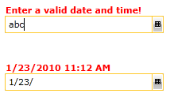

# Preview ToolTip

The __RadDateTimePicker__ control supports a preview tool tip. This feature helps you preview the inputted text while you are typing in the control's input box.

This tooltip acts like the autocomplete functionality. It is a suggestion tooltip, which tries to guess the input as you are typing it. The __RadDateTimePicker__ also shows you a validation __ErrorTooltip__ indicating that the input cannot be parsed as a valid __DateTime__.
                

>tipBy default, text input is enabled for the __RadDateTimePicker__, because you have the option to enter for instance "3 September" and the tooltip will update its value to suggest 9/3/2010.

>Additionally, the __ParseDateTimeValue__ event is raised on lost focus because text should be parsed after one has finished entering input and this is the intended default behavior. Read more [here]().

Concerning the preview tooltip the __RadDateTimePicker__ gives you the following properties:

* __TooltipContent__ - represents the tooltip's actual content.

* __TooltipTemplate__ - it is of type __DataTemplate__ and allows you to change the tooltip's default template.

* __ErrorTooltipContent__ - represents the content shown when no suggestion of the input can be made. Usually you will see this text when the input is not a valid __DateTime__ object.

Here is an example of using these properties:


```XAML
	<telerik:RadDateTimePicker x:Name="radDateTimePicker" ErrorTooltipContent="Enter a valid date and time!">
	    <telerik:RadDateTimePicker.TooltipTemplate>
	        <DataTemplate>
	            <TextBlock Text="{Binding Path=TooltipContent, ElementName=radDateTimePicker}" FontWeight="Bold" Foreground="Red"/>
	        </DataTemplate>
	    </telerik:RadDateTimePicker.TooltipTemplate>
	</telerik:RadDateTimePicker>
```

Here is the result:



>importantWhen using the above described approach you should know that setting the x:Name of the RadDateTimePicker to either __"DatePicker"__ or __"DateTimePicker"__ will lead to the ErrorTooltip not showing. The reason is that those specific names are already used in the theme of the control which lead to the binding in the custom TooltipTemplate getting broken.

## See Also

 * [Overview]()

 * [Visual Structure]()

 * [Input Modes]()

 * [Date Selection Modes]()

 * [Watermark]()
