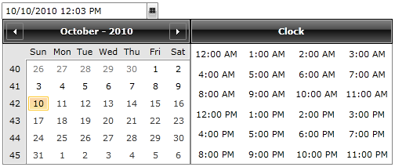

# Selection

The __RadDateTimePicker__ lets you select only single values - a single date, month or year from the Calendar and/or a single time  from the Clock.

>You can customize the selection mode in the calendar view via the __DateSelectionMode__ property. The default behavior is that you can choose from dates. [Read more here]()

## Selecting an Item Declaratively and Programmatically 

The following properties hold the information about the selection in the __RadDateTimePicker__ control:

* __SelectedValue__ - gives you a __DateTime__ representation of the selected date and time or __null__ if no value has been selected.

* __SelectedDate__ - it is the __DateTime__ that corresponds to the user selected date or __null__, if no value has been selected.

* __SelectedTime__ - it is of type __TimeSpan?__ and corresponds to the selected time representation in the clock view of the control or __null__ if no time has been selected.
* 


```XAML
	<telerik:RadDateTimePicker x:Name="radDateTimePicker"
	   SelectedDate="11/15/2010"
	   SelectedTime="10:00"/>
```


```C#
	this.radDateTimePicker.SelectedValue = new DateTime(2010, 1, 5, 10, 0, 0);
```


```VB.NET
	Me.radDateTimePicker.SelectedValue = New DateTime(2010, 1, 5, 10, 0, 0)
```

## Restricting the date item's selection

In the __RadDateTimePicker's__ calendar you can restrict the selectable items by using the following properties:

* __SelectableDateStart__ - this is the first selectable date in the __RadDateTimePicker__ calendar that a user will be able to select.

* __SelectableDateEnd__ - this is the last selectable date in the __RadDateTimePicker__ calendar that a user will be able to select.


```XAML
	<telerik:RadDateTimePicker x:Name="radDateTimePicker1" 
	   SelectableDateStart="8/10/2010"
	   SelectableDateEnd="10/10/2010"/>
```



The date items that are after the __SelectableDateEnd__ will still be visible but the user will not be able to select them. 

>You can also decide not to display date items that cannot be selected (located after the __SelectableDateEnd__ value). You can do this via the __DisplayDateStart__ and __DisplayDateEnd__ properties. [Read more here]()

## Restricting the time item's selection

In the __RadDateTimePicker's__ clock view you can restrict the selectable time items by using the __StartTime__ and __EndTime__ properties. You can even fill the Clock with a custom collection of __TimeSpan__ objects. [Read more here]()

## Restricting the date and time item's selection from the input box

Telerik introduced the __IsInputRestrictedToSelectableDates__ boolean property in Q1 2016 of UI for WPFSilverlight. By using it you could easily restrict the user from selecting a date based on the entered text inside the input area of the control. The selectable range is defined by the values set for the __SelectableDateStart__ and  __SelectableDateEnd__ properties.


```XAML
	<telerik:RadDateTimePicker x:Name="radDateTimePicker2" 
	   SelectableDateStart="8/10/2015"
	   SelectableDateEnd="10/11/2015"
	   IsInputRestrictedToSelectableDates="True"/>
```

## See Also

 * [Overview]()

 * [Events]()

 * [Formatting]()

 * [Selection]()
