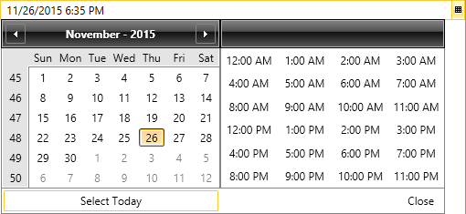

<<Comment: For better SEO, the title, description tags and H1 should also include the word RadDateTimePicker.>>
# Today Button

With the Q1 2016 release of UI for WPFSilverlight, Telerik introduced the Today button to provide the ability to select the current date and time of __RadDateTimePicker__. By default the button is not visible. However, you can make it visible by setting the __TodayButtonVisibility__ to __Visible__. You are also able to change the current content of the button using the __TodayButtonContent__.

>When the __InputMode__ is set to __DatePicker__ and the user presses the Today button, only the current date will be selected. When the __InputMode__ is set to __TimePicker__ and the user presses the Today button, the current time will be selected.
<<Comment: The Today Button for the __TimePicker__ seems (to me) like the text of the button should say Now, not Today. If it is customizeable, maybe show that in the code example.>>

#### [XAML] __TodayButtonVisibility and TodayButtonContent__

{{region raddatetimepicker-todaybutton_0}}
	<telerik:RadDateTimePicker TodayButtonVisibility="Visible" TodayButtonContent="Select Today"/>
{{endregion}}

The final result is shown on the snapshot below:

# See Also

 * [Date Selection Modes]()

 * [Selection]()
