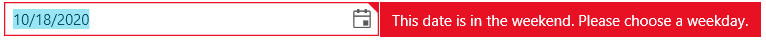

# Validation

RadDateTimePicker supports data validation that can be implemented in the view model. 

The data validation can be done through the [IDataErrorInfo](https://docs.microsoft.com/en-us/dotnet/desktop/wpf/data/how-to-implement-validation-logic-on-custom-objects?view=netframeworkdesktop-4.8) interface implemented in the view model of RadDateTimePicker. The following example shows how to enable the validation.

When the IDataErrorInfo interface is implemented, the validation logic executes when a property changes, which allows you to return an error message that will be displayed in the UI. 

__Example 1: View model with validation logic implementation__
<snippet id='raddatetimepicker-features-validation-example_1_view_model_with_validation_logic_implementation-cs' />

To show the data error, set the __ValidatesOnDataErrors__ property of the Binding to True.

__Example 2: RadDateTimePicker definition and ValidatesOnDataErrors setting__
<snippet id='raddatetimepicker-features-validation-example_2_raddatetimepicker_definition_and_validatesondataerrors_setting-xaml' />

__Example 3: Setting the view model__
<snippet id='raddatetimepicker-features-validation-example_3_setting_the_view_model-cs' />

## See Also  
 * [Overview]()
 * [Visual Structure]()
 * [Input Modes]()
 * [ViewModelBase]()
