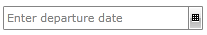
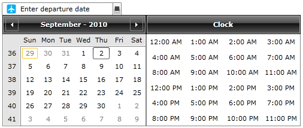

# Watermark

You can set a watermark content to your __RadDateTimePicker__ control. This watermark is a text field which will be visible when the __RadDateTimePicker__ is not focussed and empty, i.e. no value has been selected.

The Watermark is represented by a regular __RadWatermarkTextBox__ control. You can use the following properties to alter its content:

* __DateTimeWatermarkContent__ - will set the __WatermarkContent__ of the actual __RadWatermarkTextBox__ control. 

* __DateTimeWatermarkTemplate__ - will set the __WatermarkTemplate__ of the actual __RadWatermarkTextBox__ control.

>tip To read more about the __RadWatermarkTextBox__ take a look [here]().

The __DateTimeWatermarkContent__ is the simplest way to change the watermark's content. For example:


```XAML
	<telerik:RadDateTimePicker DateTimeWatermarkContent="Enter departure date"/>
```



If you want to further customize the watermark you need to set the __DateTimeWatermarkTemplate__. This property is of type __DataTemplate__ and lets you take full control of the watermark representation. For example:


```XAML
	<telerik:RadDateTimePicker Width="200">
	    <telerik:RadDateTimePicker.DateTimeWatermarkTemplate>
	        <DataTemplate>
	            <StackPanel Orientation="Horizontal">
	                <Image Source="/Silverlight.Help.RadDateTimePicker;component/Demos/Images/web-airplain.png" />
	                <TextBlock Text="Enter departure date" VerticalAlignment="Center" />
	            </StackPanel>
	        </DataTemplate>
	    </telerik:RadDateTimePicker.DateTimeWatermarkTemplate>
	</telerik:RadDateTimePicker>
```

Here is the result:



## See Also

 * [Overview]()

 * [Visual Structure]()

 * [Input Modes]()

 * [Date Selection Modes]()

 * [Preview ToolTip]()

 * [How to implement custom parsing]()
