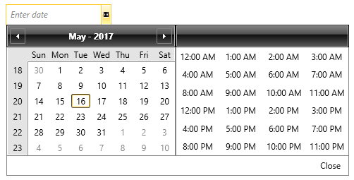
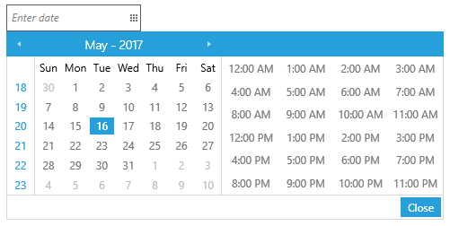

# Getting Started with {{ site.framework_name }} DateTimePicker

This tutorial will walk you through the creation of a sample application that contains RadDateTimePicker.

* [Adding Telerik Assemblies Using NuGet](#adding-telerik-assemblies-using-nuget)
* [Adding Assembly References Manually](#adding-assembly-references-manually)
* [Adding RadDateTimePicker to the Project](#adding-raddatetimepicker-to-the-project)
* [Working with Selected Values](#working-with-selected-values)
* [Manually Updating the Bound Property](#manually-updating-the-bound-property)
* [Setting a Theme](#setting-a-theme)

>Before reading this tutorial you should get familiar with the [Visual Structure]() of the __RadDateTimePicker__ control.
                 
## Adding Telerik Assemblies Using NuGet

To use __RadDateTimePicker__ when working with NuGet packages, install the `Telerik.Windows.Controls.Input.for.Wpf.Xaml` package. The [package name may vary]() slightly based on the Telerik dlls set - [Xaml or NoXaml]()

Read more about NuGet installation in the [Installing UI for WPF from NuGet Package]() article.

>tip With the 2025 Q1 release, the Telerik UI for WPF has a new licensing mechanism. You can learn more about it [here]().

## Adding Assembly References Manually

If you are not using NuGet packages, you can add a reference to the following assemblies:

* __Telerik.Licensing.Runtime__
* __Telerik.Windows.Controls__
* __Telerik.Windows.Controls.Input__

## Adding RadDateTimePicker to the Project

You can add RadDateTimePicker to your application manually by writing the XAML code in __Example 1__. You can also add the control by dragging it from the Visual Studio Toolbox and dropping it over the XAML view.

__Example 1: Adding RadDateTimePicker in XAML__

```XAML
	<telerik:RadDateTimePicker />
```

>In order to create the __RadDateTimePicker__ control you have to include the following namespace declaration:
	_xmlns:telerik="http://schemas.telerik.com/2008/xaml/presentation"_

You can also create the __RadDateTimePicker__ in code-behind:

__Example 2: Adding RadDateTimePicker in code-behind__

```C#
	RadDateTimePicker radDateTimePicker = new RadDateTimePicker();
```
```VB.NET
	Dim radDateTimePicker As New RadDateTimePicker()
```

If you run the application now you will see the default __RadDateTimePicker__ control with the default watermark content. Clicking on the control's drop down button will display a date and time representations from which you can select a single value.

#### __Figure 1: The RadDateTimePicker created by the code in Example 1__



## Working with Selected Values

You can get the selected value using the following properties:

* __SelectedValue__: A __DateTime__ representation of the selected date and time or **null** if no value has been selected.

* __SelectedDate__: The __Date__ part of the currently selected value. 

* __SelectedTime__: The __TimeOfDay__ part of the currently selected value.

__Example 3: Getting the selected values__
```C#
	DateTime? userSelectedValue = radDateTimePicker.SelectedValue;
	DateTime? userSelectedDate = radDateTimePicker.SelectedDate;
	TimeSpan? userSelectedTime = radDateTimePicker.SelectedTime;
```
```VB.NET
	Dim userSelectedValue As System.Nullable(Of DateTime) = radDateTimePicker.SelectedValue
	Dim userSelectedDate As System.Nullable(Of DateTime) = radDateTimePicker.SelectedDate
	Dim userSelectedTime As System.Nullable(Of TimeSpan) = radDateTimePicker.SelectedTime
```

Normally you would want to bind the __SelectedValue__ property to your data as demonstrated in **Example 4**.

__Example 4: Binding SelectedValue__

```XAML
	<telerik:RadDateTimePicker SelectedValue="{Binding Established}" />
```

## Manually Updating the Bound Property

In case the bound property value needs to be manually updated at some state, the __DateTimeText__ property of the control can simply be set to be equal to the __CurrentDateTimeText__ one. The __CurrentDateTimeText__ property is updated each time the user types in the textbox, whereas the __DateTimeText__ is updated once the textbox has lost focus, for example.  

__Example 5: Manually updating the bound property__

```C#
	this.DateTimePicker.DateTimeText = this.DateTimePicker.CurrentDateTimeText;
```
```VB.NET
	Me.DateTimePicker.DateTimeText = Me.DateTimePicker.CurrentDateTimeText
```

## Setting a Theme

The controls from our suite support different themes. You can see how to apply a theme different than the default one in the [Setting a Theme]() help article.

>important Changing the theme using implicit styles will affect all controls that have styles defined in the merged resource dictionaries. This is applicable only for the controls in the scope in which the resources are merged. 

To change the theme, you can follow the steps below:
* Choose between the themes and add reference to the corresponding theme assembly (ex: **Telerik.Windows.Themes.Windows8.dll**). You can see the different themes applied in the **Theming** examples from our [WPF Controls Examples](https://demos.telerik.com/wpf/)[Silverlight Controls Examples](https://demos.telerik.com/silverlight/) application.

* Merge the ResourceDictionaries with the namespace required for the controls that you are using from the theme assembly. For __RadDateTimePicker__, you will need to merge the following resources:

	* __Telerik.Windows.Controls__
	* __Telerik.Windows.Controls.Input__

__Example 8__ demonstrates how to merge the ResourceDictionaries so that they are applied globally for the entire application.

__Example 5: Merge the ResourceDictionaries__  
```XAML
		<Application.Resources>
			<ResourceDictionary>
				<ResourceDictionary.MergedDictionaries>
	                <ResourceDictionary Source="/Telerik.Windows.Themes.Windows8;component/Themes/System.Windows.xaml"/>
	                <ResourceDictionary Source="/Telerik.Windows.Themes.Windows8;component/Themes/Telerik.Windows.Controls.xaml"/>
	                <ResourceDictionary Source="/Telerik.Windows.Themes.Windows8;component/Themes/Telerik.Windows.Controls.Input.xaml"/>
				</ResourceDictionary.MergedDictionaries>
			</ResourceDictionary>
		</Application.Resources>
```

__Figure 2__ shows __RadDateTimePicker__ with the **Windows8** theme applied.
	
#### __Figure 2: RadDateTimePicker with the Windows8 theme__




## Telerik UI for WPF Learning Resources

* [Telerik UI for WPF DateTimePicker Component](https://www.telerik.com/products/wpf/datetimepicker.aspx)
* [Getting Started with Telerik UI for WPF Components]()
* [Telerik UI for WPF Installation]()
* [Telerik UI for WPF and WinForms Integration]()
* [Telerik UI for WPF Visual Studio Templates]()
* [Setting a Theme with Telerik UI for WPF]()
* [Telerik UI for WPF Virtual Classroom (Training Courses for Registered Users)](https://learn.telerik.com/learn/course/external/view/elearning/16/telerik-ui-for-wpf) 
* [Telerik UI for WPF License Agreement](https://www.telerik.com/purchase/license-agreement/wpf-dlw-s)


## See Also

* [Use the control as a date picker or time picker independently]()

* [Customizing the Preview Tooltip]()

* [The Watermark]()

* [Enhance the parsing mechanism]()

* [Populating the clock with custom clock items]()
