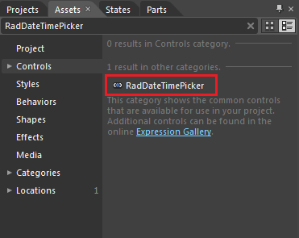
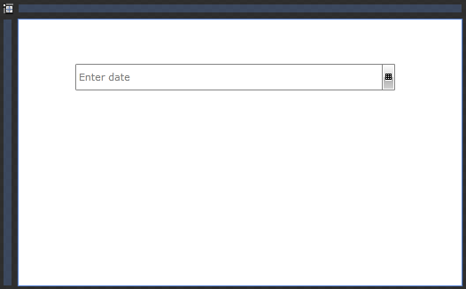

# Getting Started

__RadDateTimePicker__ is a control that displays date and/or time representation, where the user can select a single value. __RadDateTimePicker__ is an advanced control providing full Expression Blend support. This topic will help you to quickly get started using the control. It will focus on the following:

* [Creating a RadDateTimePicker](#creating-a-raddatetimepicker)

* [Working with the RadDateTimePicker control](#working-with-the-raddatetimepicker-control)

* [Styles and Templates](#styles-and-templates)

>Before reading this tutorial you should get familiar with the [Visual Structure]() of the __RadDateTimePicker__ control.
                 
<!-- -->   

>In order to use __RadDateTimePicker__ control in your projects you have to add references to the following assemblies:
1. __Telerik.Windows.Controls.Input.dll__
2. __Telerik.Windows.Controls.dll__

## Creating a RadDateTimePicker

Open the Asset Library (Window->Assets) in Expression Blend and start writing the name of the __RadDateTimePicker__ in the search box.
         

Drag a __DateTimePicker__ on the artboard.
         

The following snippet was generated for you in XAML:

>In order to create the __RadDateTimePicker__ control you have to include the following reference:
_xmlns:telerik="http://schemas.telerik.com/2008/xaml/presentation"_

#### __XAML__
{{region raddatetimepicke-getting-started_1}}
	<telerik:RadDateTimePicker VerticalAlignement="Top"/>
{{endregion}}

You can also create the __RadDateTimePicker__ in code-behind:

#### __C#__
{{region raddatetimepicke-getting-started_2}}
	RadDateTimePicker radDateTimePicker = new RadDateTimePicker();
{{endregion}}

#### __VB.NET__
{{region raddatetimepicke-getting-started_3}}
	Dim radDateTimePicker As New RadDateTimePicker()
{{endregion}}

There are two things to pay attention to in the above code snippet. The first is the declaration of the Telerik.Windows.Controls namespace from Telerik.Windows.Controls.Input assembly and the second is the declaration of the __RadDateTimePicker__ control itself.

If you run your application now you will see the default __RadDateTimePicker__ control.  In the control's input box you will see the default watermark content. Clicking on the control's drop down button will display a date and time representations from which you can select a single value.

>tipBy default, text input is enabled for the __RadDateTimePicker__, because you have the option to enter for instance "3 September" and the tooltip will update its value to suggest 9/3/2010.

You can get the selected value using the following properties:

* __SelectedValue__ - gives you a __DateTime?__ representation of the selected date and time or null if no value has been selected.

* __SelectedDate__ - is the __DateTime?__ that corresponds to the user selected date or null, if no value has been selected. 

* __SelectedTime__ - is of type __TimeSpan?__ and correspond to the selected time representation in the clock view of the control or null if no time has been selected. 

Here is an example of getting these properties:

#### __C#__
{{region raddatetimepicke-getting-started_4}}
	DateTime? userSelectedValue = this.radDateTimePicker.SelectedValue;
	DateTime? userSelectedDate = this.radDateTimePicker.SelectedDate;
	TimeSpan? userSelectedTime = this.radDateTimePicker.SelectedTime;
{{endregion}}

#### __VB.NET__

{{region raddatetimepicke-getting-started_5}}
	Dim userSelectedValue As System.Nullable(Of DateTime) = Me.radDateTimePicker.SelectedValue
	Dim userSelectedDate As System.Nullable(Of DateTime) = Me.radDateTimePicker.SelectedDate
	Dim userSelectedTime As System.Nullable(Of TimeSpan) = Me.radDateTimePicker.SelectedTime
{{endregion}}

>tipIf you want to set a specific value to be loaded to the control's input box you can bind the __SelectedValue__ property to your data.

## Working with the RadDateTimePicker control

In order to learn how to use the __RadDateTimePicker__ and what capabilities it holds, read the various topics that describe its features.

* [Use the control as a date picker or time picker independently]()

* [Customizing the Preview Tooltip]()

* [The Watermark]()

* [Enhance the parsing mechanism]()

* Customize the [time]() and [date]() items 

* For populating the clock with custom clock items through binding read more [here]().

## Styles and Templates

Read the [Styles and Templates]() section which is entirely dedicated to styling and templating the __RadDateTimePicker__ control.

# See Also

 * [Overview]()

 * [Visual Structure]()

 * [Styles and Templates - Overview]()

 * [Templates Structure]()

 * [Events]()
