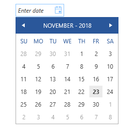

# How to hide week numbers

The purpose of this article is to demonstrate how the week numbers in the RadCalendar part inside the drop down of a __RadDateTimePicker__ can be hidden. 

## Hiding the week numbers

In order to hide the week numbers, one can use the __CalendarStyle__ property of the __RadDateTimePicker__. This style is applied to the __RadCalendar__, placed inside the drop down portion of the control. This property is useful, because it allows you to set additional properties to the calendar. So, here are the steps to create a __CalendarStyle__ and remove week numbers:

* First, create a __Style__ for __RadCalendar__:

	__Example 1: Defining a style for RadCalendar__

	```XAML
		<UserControl.Resources>
			<Style x:Key="calendarStyle" TargetType="telerik:RadCalendar">
				<!--....-->
			</Style>
		</UserControl.Resources>
	```

* Then, add a __Setter__ for the __AreWeekNumbersProperty__ property and set the __Value__ to __False__

	__Example 2: Setting the AreWeekNumbersVisible property__
	```XAML
		<UserControl.Resources>
			<Style x:Key="calendarStyle" TargetType="telerik:RadCalendar">
				<Setter Property="AreWeekNumbersVisible" Value="False" />
			</Style>
		</UserControl.Resources>
	```

* The final step is to create a __RadDateTimePicker__ control and set __CalendarStyle__ to the Style that you created. Please, pay attention that if the __InputMode__ is set to __TimePicker__, the __CalendarStyle__ will take no effect on the control.

	__Example 3: Setting the CalendarStyle property__

	```XAML
		<telerik:RadDateTimePicker Width="100"                            
						InputMode="DatePicker"                            
						CalendarStyle="{StaticResource calendarStyle}"                            
						VerticalAlignment="Center"/>
	```

#### __Figure 1: Result from Example 3 in the Office2016 theme__


## See also 

* [Input Modes]()
* [How to Set the First Day of the Week]()