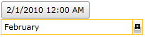

# How to implement custom parsing

The purpose of this tutorial is to show you how to use the __RadDateTimePicker__, implementing your own logic for parsing the value in a way that suits your needs. 

The following example will allow you to enter a month's name into the __RadDateTimePicker's__ input box. As a result the control will assume that the chosen date is the first day of that month and the year will be equal to the current year. Whenever the user enters some text that cannot be parsed it will simply show you an error preview tooltip.

>tipRead more about the __RadDateTimePicker's__ events [here]().

The final result should look like the snapshots below:



You can do this by: 

* Handling the __ParseDateTimeValue__ event.

* Get the user-entered value of the __RadDateTimePicker__ input box control using the __ParseDateTimeEventArgs__ parameter's __TextToParse__ property.

* Set the __ParseDateTimeEventArgs__ parameter's __Result__ property whenever the parsing is successful.

* Set the __ParseDateTimeEventArgs__ parameter's __IsParsingSuccessful__ property to __False__ to indicate an error.

>When you enter some text in the control's input box the __ParseDateTimeValue__ event is fired and tries to parse the input. If the parsing is possible it sets the __ParseDateTimeEventArgs__ parameter's __IsParsingSucceful__ property to __True__. If in this case you hit the __Enter__ key on your keyboard or lose focus in any other way, the __SelectionChanged__ event is invoked.

## Using the ParseDateTimeValue event

First you have to define your __RadDateTimePicker__ control and point out that you want to implement the __ParseDateTimeValue__ event.


```XAML
	<telerik:RadDateTimePicker x:Name="radDateTimePicker" 
	                           ParseDateTimeValue="radDateTimePicker_ParseDateTimeValue"/>
```

Then in the event handler you can provide the parsing logic. For the current example you have to get the entered text and check if it represents a valid month's name.


```C#
	private void radDateTimePicker_ParseDateTimeValue(object sender, Telerik.Windows.Controls.ParseDateTimeEventArgs args)
	{
	    string input = args.TextToParse.ToLower();
	    System.Globalization.DateTimeFormatInfo formatInfo = new System.Globalization.DateTimeFormatInfo();
	    int monthIndex = 1;
	    foreach (string month in formatInfo.MonthNames)
	    {
	        if (input.Contains(month.ToLower()) == true)
	            break;
	        monthIndex++;
	    }
	    if (monthIndex < 12)
	    {
	        args.Result = new DateTime(2010, monthIndex, 1);
	    }
	    else
	    {
	        args.IsParsingSuccessful = false;
	    }
	}
```


```VB.NET
	Private Sub radDateTimePicker_ParseDateTimeValue(sender As Object, args As Telerik.Windows.Controls.ParseDateTimeEventArgs)
	    Dim input As String = args.TextToParse.ToLower()
	    Dim formatInfo As New System.Globalization.DateTimeFormatInfo()
	    Dim monthIndex As Integer = 1
	    For Each month As String In formatInfo.MonthNames
	        If input.Contains(month.ToLower()) = True Then
	            Exit For
	        End If
	        monthIndex += 1
	    Next
	    If monthIndex < 12 Then
	        args.Result = New DateTime(2010, monthIndex, 1)
	    Else
	        args.IsParsingSuccessful = False
	    End If
	End Sub
```
	
Here is the result:


>tipIf you want to validate the input date in code behind using __ParseDateTimeValue__ event and set the date back to a previous value if the validation fails, you can still do this. This time you have to set the __ParseDateTimeEventArgs__ parameter's __IsParsingSucceful__ property to __True__ no matter of the errors. However, when validation errors occur you can set the __Result__ property to __ParseDateTimeEventArgs__ parameter's __PreviousValue__ property. In this way if you enter some invalid data, the [Preview Tooltip]() will show you the __PreviousValue__ property's value which will be the last successful input. If you hit enter now, the __RadDateTimePicker__ will select the value indicated by the __Preview Tooltip__.

## See Also

 * [Visual Structure]()

 * [Events]()

 * [Preview ToolTip]()
