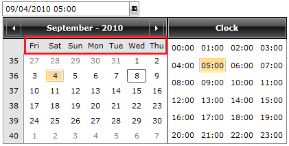

# How to set the first day of the week

## 

The purpose of this tutorial is to show you how to modify the default order of the days in the calendar view of your __RadDateTimePicker__ control.

You do this through the __RadDateTimePicker__ control's __Culture__ property. 

#### __XAML__

{{region raddatetimepicker-how-to-set-first-day-calendar_0}}
	<telerik:RadDateTimePicker x:Name="radDateTimePicker"/>
	{{endregion}}

For the purpose of this example, after defining your __RadDateTimePicker__ control you extend the user control's constructor located in the code behind file:

* Create a __DateTimeFormatInfo__ object specifying the value of a property called __FirstDayOfWeek.__This property is used to indicate the first day of the week. 

* To make your __RadDateTimePicker__ control work with this __DateTimeFormatInfo__ object you have to assign it to a __CultureInfo's____DateTimeFormat__ property. 

* Finally you have to assign the __CultureInfo__ object to the __Culture__ property of your __RadDateTimePicker__control.

#### __C#__

{{region raddatetimepicker-how-to-set-first-day-calendar_1}}
	public SetFirstDayOfWeekExample()
	{
	    InitializeComponent();
	    CultureInfo cultureInfo = new CultureInfo( "en-US" );
	    DateTimeFormatInfo dateInfo = new DateTimeFormatInfo();
	    dateInfo.FirstDayOfWeek = DayOfWeek.Friday;
	    cultureInfo.DateTimeFormat = dateInfo;
	    this.radDateTimePicker.Culture = cultureInfo;
	}
	{{endregion}}

#### __VB.NET__

{{region raddatetimepicker-how-to-set-first-day-calendar_2}}
	Public Sub New()
	 InitializeComponent()
	 Dim cultureInfo As New CultureInfo("en-US")
	 Dim dateInfo As New DateTimeFormatInfo()
	 dateInfo.FirstDayOfWeek = DayOfWeek.Friday
	 cultureInfo.DateTimeFormat = dateInfo
	 Me.radDateTimePicker.Culture = cultureInfo
	End Sub
	{{endregion}}

Here is the final result:

         
      

# See Also

 * [Visual Structure]()

 * [Formatting]()

 * [Date Items]()

 * [How to create a select-only RadDateTimePicker]()
