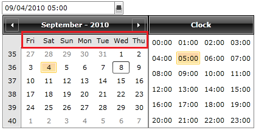

# How to Set the First Day of the Week

The purpose of this tutorial is to show you how to modify the default order of the days in the calendar view of your __RadDateTimePicker__ control. There are two ways to do this.

## Through the CultureInfo.DateTimeFormat property

Let's assume you've defined RadDateTimePicker as shown in **Example 1**.

__Example 1: RadDateTimePicker definition__

<snippet id='raddatetimepicker-how-to-set-first-day-calendar-example_1_raddatetimepicker_definition-xaml' />

You can then set the **FirstDayOfWeek** property of the current culture's **DateTimeFormat** as demonstrated in **Example 2**.

__Example 2: Setting FirstDayOfWeek__

<snippet id='raddatetimepicker-how-to-set-first-day-calendar-example_2_setting_firstdayofweek-cs' />

<snippet id='raddatetimepicker-how-to-set-first-day-calendar-example_2_setting_firstdayofweek-vb' />

## Through the CalendarStyle property

Another way to achieve the same result is to define a style targeting the **RadCalendar** control and add a setter for the **FirstDayOfWeek** property. **Example 3** demonstrates such a style.

__Example 3: Defining a custom RadCalendar style__

<snippet id='raddatetimepicker-how-to-set-first-day-calendar-example_3_defining_a_custom_radcalendar_style-xaml' />

>If you're using [implicit styles](), you should base your style on the __RadCalendarStyle__.

You can then use this style implicitly or set it for a single RadDateTimePicker instance through the control's **CalendarStyle** property as shown in **Example 4** and **Example 5**.

__Example 4: Defining an implicit style__

<snippet id='raddatetimepicker-how-to-set-first-day-calendar-example_4_defining_an_implicit_style-xaml' />

>If you're using [implicit styles](), you should base your style on the __RadDateTimePickerStyle__.

__Example 5: Setting an individual calendar's CalendarStyle property__

<snippet id='raddatetimepicker-how-to-set-first-day-calendar-example_5_setting_an_individual_calendar_s_calendarstyle_property-xaml' />

**Figure 1** shows the final result.

#### __Figure 1: RadDateTimePicker with week starting from Friday__

## See Also

 * [Visual Structure]()

 * [Formatting]()

 * [Date Items]()

 * [How to create a select-only RadDateTimePicker]()
