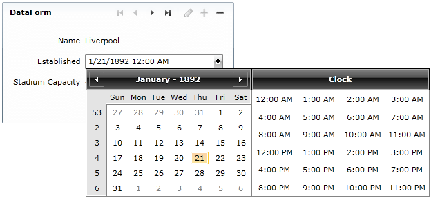

# How to use RadDateTimePicker in a DataForm

This tutorial will show you how easy and straightforward it might be to use a __RadDateTimePicker__ control in a __DataForm__.

In order to do this you need to alter the default __DataTemplate__ of your __DataForm__ control. You have to indicate that the __RadDateTimePicker__ control is to be used for a particular field, whenever the entity is in edit mode.

For the purpose of this example the first thing you have to do is to define the __DataForm__ and populate it with sample data. Below are the custom business object definitions, as well as the __DataForm__ declaration.

#### __C#__

{{region raddatetimepicker-how-to-use-in-dataform_0}}
	public class Club
	{
	    public Club( string name, DateTime established, int stadiumCapacity )
	    {
	        this.Name = name;
	        this.Established = established;
	        this.StadiumCapacity = stadiumCapacity;
	    }
	    public string Name
	    {
	        get;
	        set;
	    }
	    public DateTime? Established
	    {
	        get;
	        set;
	    }
	    public int StadiumCapacity
	    {
	        get;
	        set;
	    }
	    public static IEnumerable<Club> GetClubs()
	    {
	        ObservableCollection<Club> clubs = new ObservableCollection<Club>();
	        clubs.Add( new Club( "Liverpool", new DateTime( 1892, 1, 1 ), 45362 ) );
	        clubs.Add( new Club( "Manchester Utd.", new DateTime( 1878, 1, 1 ), 76212 ) );
	        clubs.Add( new Club( "Chelsea", new DateTime( 1905, 1, 1 ), 42055 ) );
	        clubs.Add( new Club( "Arsenal", new DateTime( 1886, 1, 1 ), 60355 ) );
	        return clubs;
	    }
	}
{{endregion}}

#### __VB.NET__

{{region raddatetimepicker-how-to-use-in-dataform_1}}
	Public Class Club
	 Public Sub New(name As String, established As DateTime, stadiumCapacity As Integer)
	  Me.Name = name
	  Me.Established = established
	  Me.StadiumCapacity = stadiumCapacity
	 End Sub
	 Public Property Name() As String
	  Get
	   Return m_Name
	  End Get
	  Set
	   m_Name = Value
	  End Set
	 End Property
	 Private m_Name As String
	 Public Property Established() As System.Nullable(Of DateTime)
	  Get
	   Return m_Established
	  End Get
	  Set
	   m_Established = Value
	  End Set
	 End Property
	 Private m_Established As System.Nullable(Of DateTime)
	 Public Property StadiumCapacity() As Integer
	  Get
	   Return m_StadiumCapacity
	  End Get
	  Set
	   m_StadiumCapacity = Value
	  End Set
	 End Property
	 Private m_StadiumCapacity As Integer
	 Public Shared Function GetClubs() As IEnumerable(Of Club)
	  Dim clubs As New ObservableCollection(Of Club)()
	  clubs.Add(New Club("Liverpool", New DateTime(1892, 1, 1), 45362))
	  clubs.Add(New Club("Manchester Utd.", New DateTime(1878, 1, 1), 76212))
	  clubs.Add(New Club("Chelsea", New DateTime(1905, 1, 1), 42055))
	  clubs.Add(New Club("Arsenal", New DateTime(1886, 1, 1), 60355))
	  Return clubs
	 End Function
	End Class
{{endregion}}

>Remember that in order to use the __DataForm__ control you will have to add a reference to the __System.Windows.Controls.Data.DataForm.Toolkit__ library.

#### __XAML__

{{region raddatetimepicker-how-to-use-in-dataform_2}}
	<Grid x:Name="LayoutRoot"
	        Background="White">
	    <dataForm:DataForm x:Name="dataForm"
	                       Header="DataForm"
	                       AutoGenerateFields="False"
	                       CommandButtonsVisibility="All">
	    </dataForm:DataForm>
	</Grid>
{{endregion}}

#### __C#__

{{region raddatetimepicker-how-to-use-in-dataform_3}}
	this.radGridView.ItemsSource = Club.GetClubs();
{{endregion}}

#### __VB.NET__

{{region raddatetimepicker-how-to-use-in-dataform_4}}
	Me.radGridView.ItemsSource = Club.GetClubs()
{{endregion}}

The next and final step in this example is to define the __DataTemplate__ which will be used when the data is in edit mode. There you should point out that for some of your data fields you want to use the __RadDateTimePicker__.

Here is the complete XAML:

#### __XAML__

{{region raddatetimepicker-how-to-use-in-dataform_5}}
	<Grid x:Name="LayoutRoot"
	        Background="White">
	    <dataForm:DataForm x:Name="dataForm"
	                       Header="DataForm"
	                       AutoGenerateFields="False"
	                       CommandButtonsVisibility="All">
	        <dataForm:DataForm.EditTemplate>
	            <DataTemplate>
	                <StackPanel>
	                    <dataForm:DataField Label="Name">
	                        <TextBlock Text="{Binding Name}"></TextBlock>
	                    </dataForm:DataField>
	                    <dataForm:DataField Label="Established">
	                        <telerik:RadDateTimePicker SelectedValue="{Binding Established}" Width="200" />
	                    </dataForm:DataField>
	                    <dataForm:DataField Label="Stadium Capacity">
	                        <TextBlock Text="{Binding StadiumCapacity}"></TextBlock>
	                    </dataForm:DataField>
	                </StackPanel>
	            </DataTemplate>
	        </dataForm:DataForm.EditTemplate>
	    </dataForm:DataForm>
	</Grid>
{{endregion}}

Here is the result:

# See Also

 * [Overview]()

 * [Visual Structure]()

 * [How to use RadDateTimePicker in a Grid]()
