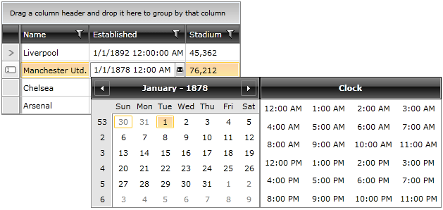

# How to use RadDateTimePicker in a Grid

This tutorial will guide you through creating a custom __RadDateTimePicker__ column in a __RadGridView__ control.

To do this you need to alter the default __CellEditTemplate__ in your __RadGridView__ control. You have to indicate that the __RadDateTimePicker__ control is to be used whenever the cell enters in edit mode.

For the purpose of this example the first thing you have to do is to define the __RadGridView__ and populate it with sample data. Below are the custom business object definitions, as well as the __RadGridView__ declaration.

#### __C#__

```C#
	public class Club
	{
	    public Club(string name, DateTime established, int stadiumCapacity)
	    {
	        this.Name = name;
	        this.Established = established;
	        this.StadiumCapacity = stadiumCapacity;
	    }
	    public string Name
	    {
	        get;
	        set;
	    }
	    public DateTime? Established
	    {
	        get;
	        set;
	    }
	    public int StadiumCapacity
	    {
	        get;
	        set;
	    }
	    public static IEnumerable<Club> GetClubs()
	    {
	        ObservableCollection<Club> clubs = new ObservableCollection<Club>();
	        clubs.Add(new Club("Liverpool", new DateTime(1892, 1, 1), 45362));
	        clubs.Add(new Club("Manchester Utd.", new DateTime(1878, 1, 1), 76212));
	        clubs.Add(new Club("Chelsea", new DateTime(1905, 1, 1), 42055));
	        clubs.Add(new Club("Arsenal", new DateTime(1886, 1, 1), 60355));
	        return clubs;
	    }
	}
```


#### __VB.NET__

```VB.NET
	Public Class Club
	    Public Sub New(name As String, established As DateTime, stadiumCapacity As Integer)
	        Me.Name = name
	        Me.Established = established
	        Me.StadiumCapacity = stadiumCapacity
	    End Sub
	    Public Property Name() As String
	        Get
	            Return m_Name
	        End Get
	        Set(value As String)
	            m_Name = value
	        End Set
	    End Property
	    Private m_Name As String
	    Public Property Established() As System.Nullable(Of DateTime)
	        Get
	            Return m_Established
	        End Get
	        Set(value As System.Nullable(Of DateTime))
	            m_Established = value
	        End Set
	    End Property
	    Private m_Established As System.Nullable(Of DateTime)
	    Public Property StadiumCapacity() As Integer
	        Get
	            Return m_StadiumCapacity
	        End Get
	        Set(value As Integer)
	            m_StadiumCapacity = value
	        End Set
	    End Property
	    Private m_StadiumCapacity As Integer
	    Public Shared Function GetClubs() As IEnumerable(Of Club)
	        Dim clubs As New ObservableCollection(Of Club)()
	        clubs.Add(New Club("Liverpool", New DateTime(1892, 1, 1), 45362))
	        clubs.Add(New Club("Manchester Utd.", New DateTime(1878, 1, 1), 76212))
	        clubs.Add(New Club("Chelsea", New DateTime(1905, 1, 1), 42055))
	        clubs.Add(New Club("Arsenal", New DateTime(1886, 1, 1), 60355))
	        Return clubs
	    End Function
	End Class
```

#### __XAML__

```XAML
	<telerik:RadGridView Name="radGridView"
	                     AutoGenerateColumns="False">
	    <telerik:RadGridView.Columns>
	        <telerik:GridViewDataColumn Header="Name"
	                                    DataMemberBinding="{Binding Name}" />
	        <telerik:GridViewDataColumn Header="Established"
	                                    DataMemberBinding="{Binding Established}" />
	        <telerik:GridViewDataColumn Header="Stadium"
	                                    DataMemberBinding="{Binding StadiumCapacity}"
	                                    DataFormatString="{}{0:N0}" />
	    </telerik:RadGridView.Columns>
	</telerik:RadGridView>
```

#### __C#__

```C#
	this.radGridView.ItemsSource = Club.GetClubs();
```

#### __VB.NET__

```VB.NET
	Me.radGridView.ItemsSource = Club.GetClubs()
```

The next and final step in the example is to define the actual __CellTemplate__ used for the DateTime column. Here is the complete XAML:

#### __XAML__

```XAML
	<telerik:RadGridView Name="radGridView1"
	                     AutoGenerateColumns="False">
	    <telerik:RadGridView.Columns>
	        <telerik:GridViewDataColumn Header="Name"
	                                    DataMemberBinding="{Binding Name}" />
	        <telerik:GridViewDataColumn Header="Established"
	                                    DataMemberBinding="{Binding Established}">
	            <telerik:GridViewDataColumn.CellEditTemplate>
	                <DataTemplate>
	                    <telerik:RadDateTimePicker SelectedValue="{Binding Established, Mode=TwoWay}"/>
	                </DataTemplate>
	            </telerik:GridViewDataColumn.CellEditTemplate>
	        </telerik:GridViewDataColumn>
	        <telerik:GridViewDataColumn Header="Stadium"
	                                    DataMemberBinding="{Binding StadiumCapacity}"
	                                    DataFormatString="{}{0:N0}" />
	    </telerik:RadGridView.Columns>
	</telerik:RadGridView>
```

Here is the result:



## See Also

 * [Overview]()

 * [Visual Structure]()


 * [How to use RadDateTimePicker in a DataForm]()

