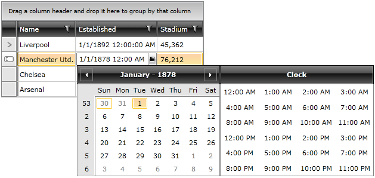

# How to use RadDateTimePicker in a Grid

This tutorial will guide you through creating a custom __RadDateTimePicker__ column in a __RadGridView__ control.

To do this you need to alter the default __CellEditTemplate__ in your __RadGridView__ control. You have to indicate that the __RadDateTimePicker__ control is to be used whenever the cell enters in edit mode.

For the purpose of this example the first thing you have to do is to define the __RadGridView__ and populate it with sample data. Below are the custom business object definitions, as well as the __RadGridView__ declaration.

<snippet id='raddatetimepicker-how-to-use-in-grid-block_1-cs' />

<snippet id='raddatetimepicker-how-to-use-in-grid-block_1-vb' />

<snippet id='raddatetimepicker-how-to-use-in-grid-block_2-xaml' />

<snippet id='raddatetimepicker-how-to-use-in-grid-block_3-cs' />

<snippet id='raddatetimepicker-how-to-use-in-grid-block_3-vb' />

The next and final step in the example is to define the actual __CellTemplate__ used for the DateTime column. Here is the complete XAML:

<snippet id='raddatetimepicker-how-to-use-in-grid-block_4-xaml' />

Here is the result:

## See Also

 * [Overview]()

 * [Visual Structure]()


 * [How to use RadDateTimePicker in a DataForm]()

