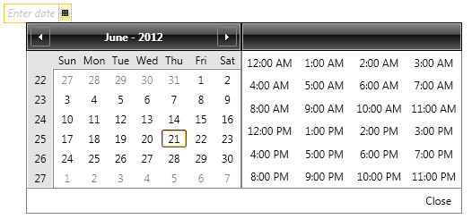
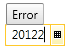
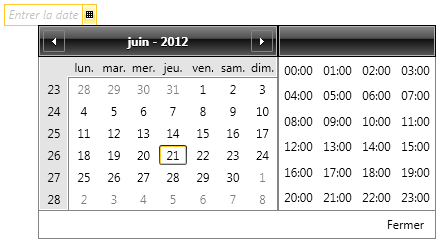
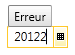

# Localization

The built-in localization mechanism in Silverlight and WPF allows you to localize any string resource used by the RadDateTimePicker control. Once translated, you might use your resources in both Silverlight and WPF projects without changing anything.      	

>tip To learn more about the ways to localize the controls from the UI for SilverlightWPF suite please read the common topic about [Localization](http://www.telerik.com/help/silverlight/common-localization.html)[Localization](http://www.telerik.com/help/wpf/common-localization.html).       	

In __RadDatetimePicker__ you can localize the Enter date message, Close link and  Error tooltip:

The next images show the DateTimePicker localized in French:

>The days of the week and months are automatically localized by the DateTime class using the current culture settings of the application.
        	
## Supported Languages

__RadDateTimePicker__ can be translated in one of the following supported languages using the framework’s localization mechanism:

* English
* German
* Spanish
* French
* Italian
* Dutch
* Turkish

More information on how to achieve this you can find in the [Localization Using Built-in Resources] () article.

## Resource Keys    
   
The resources of the control can be localized by using an unique identifier called resource key that is assigned to each localizable string. Below you may find a list of the Resources available and their default values:    	
		
Key | Value
---|---
Close | Close 
EnterDate | Enter Date 
Error | Error
Today | Today

>The __TodayButtonContent__ is considered as the ResourceKey of the button when it is set. 