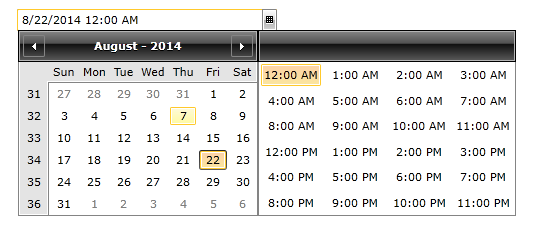

# Overview

## 

Thank you for choosing __Telerik RadDateTimePicker__!
        

__RadDateTimePicker__is a convenient way to get rid of boring date and time parsing and data validation. __RadDateTimePicker__is easy and simple, but yet essential way to improve end-user experience. You can set InputMode that allows you to use __RadDateTimePicker__as __DatePicker__, __TimePicker__or __both__. Moreover, you can control the layout of the popups that shows time and/or date values as well as to use the rich data model in
          SilverlightWPF to populate content dynamically.
        

This control fully replaces the functionality of __RadTimePicker__and __RadDatePicker__controls.
        

This is a list with short descriptions of the top-of-the-line features of Telerik's __RadDateTimePicker__control:
        

* __DatePicker and TimePicker controls - DatePicker__ and __TimePicker__ can be used independently from the __RadDateTimePicker__ control. [Read more]()

* __Display Modes__ - You can display the __DateTimePicker__ in four different views -  Months, Years, Decades, Centuries. Thus, you can adjust the date-time-picker component to meet your very own business needs. [Read more]()

* __Multiple Months View__ - Telerik SilverlightWPF__DateTimePicker__ can be easily configured to show more than one month in the calendar area. Thus, you can make the navigation easier and faster. [Read more](745AAE86-4E0D-4617-98F7-B686CFB031B1)

* __Powerful Databinding__- The SilverlightWPF__DateTimePicker__ control by Telerik can be bound to various datasource types, such as Object, XML and WCF services.
          

* __Keyboard Navigation__ - __RadDateTimePicker__ supports the standard browser navigation paradigm. Users can tab across the page elements till they reach the date-picker element. Then, they can type something in the input field, click tab to focus the drop-arrow element and then press the [ Enter] key. Calendar will appear.  The users can go forward/backward over the individual days by pressing the [Tab]/[Shift+Tab] keys. A day can be selected by clicking the [Enter] button.
          

* __Advanced Parser__ - You can enter any number or string in the input field of __RadDateTimePicker__ and the entered value will be transformed to a valid date.  For example, if you type “1”, the first day of the month will be shown after leaving the input field. If you type “Monday”, the corresponding date of the current week will be selected. [Read more]()

* __Styling and Appearance__ - Telerik SilverlightWPF__DateTimePicker__ can be fully customized using Expression Blend. There are also several pre-defined themes that can be used to style the control. [Read more]()

* __Enhanced Routed Events Framework__ - To help your code become even more elegant and concise, we implemented Enhanced Routed Events Framework for __RadControls__ for SilverlightWPF.  This gives you more freedom when you design your applications since you can write instance handlers as well as class handlers for the routed events of our controls. [Read more]()

* __Watermark__ - The __DateTimePicker__ control allows the user to define and use watermarks in the date and time fields. [Read more]()

Check out the RadDateTimePicker demos at:
          [http://demos.telerik.com/silverlight/#DateTimePicker/FirstLook](http://demos.telerik.com/silverlight/#DateTimePicker/FirstLook)[http://demos.telerik.com/wpf/](http://demos.telerik.com/wpf/)

# See Also

 * [Visual Structure]()

 * [Getting Started]()

 * [Styles and Templates]()

 * [Events]()
