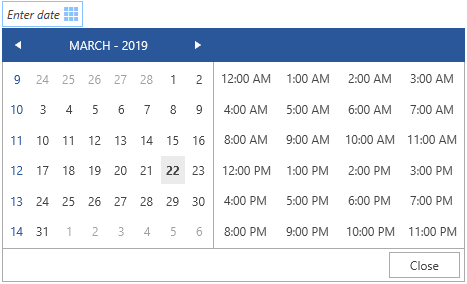

# Styling the Calendar

This article shows how to customize the default Style of the RadCalendar control shown in the RadDateTimePicker's dropdown.

To style the RadDateTimePicker's calendar, define a __Style__ object __targeting the RadCalendar__ control and assign it to the __CalendarStyle__ property of RadDateTimePicker. 

If you use the [Xaml]() version of the Telerik dlls, you will need to extract the whole style (including the ControlTemplate) of the RadCalendar control used in RadDateTimePicker. The original style can be found in the [Telerik.Windows.Controls.Input.xaml]() file. In the NoXaml scenario, you do not need this. Instead, you should base the custom Style on the default __RadCalendarStyle__ resource.

__Example 1: Hiding the week names from the calendar using the CalendarStyle property__  
```XAML
	<Window.Resources>
        <!-- If you are using the Xaml binaries, you do not have to set the BasedOn attribute-->
        <Style x:Key="CalendarStyle" TargetType="telerik:RadCalendar" BasedOn="{StaticResource RadCalendarStyle}">
            <Setter Property="AreWeekNamesVisible" Value="False" />
        </Style>
    </Window.Resources>
    <Grid>
        <telerik:RadDateTimePicker VerticalAlignment="Center" HorizontalAlignment="Center" CalendarStyle="{StaticResource CalendarStyle}" />
    </Grid>
```

#### __Figure 1: Result from Example 1 in the Office2016 theme__


The RadCalendar control consists of CalendarButton controls representing the days, months, weeks, etc. Those can be customized via the __DayButtonStyle__, __MonthButtonStyle__, __YearButtonStyle__ and __DecadeButtonStyle__ properties of RadCalendar. The data context passed to the CalendarButton controls is an object of type [CalendarButtonContent](https://docs.telerik.com/devtools/wpf/api/telerik.windows.controls.calendar.calendarbuttoncontent) which contains information about the button type (day, week, month, etc.), date, selection state, and others.

__Example 2: Setting a tooltip for the days in the calendar__  
```XAML
	<telerik:RadDatePicker>
		<telerik:RadDatePicker.CalendarStyle>
			<Style TargetType="telerik:RadCalendar">
				<Setter Property="DayButtonStyle">
					<Setter.Value>
						<Style TargetType="calendar:CalendarButton">
							<Setter Property="telerik:RadToolTipService.ToolTipContent" Value="{Binding Date}"/>
						</Style>
					</Setter.Value>
				</Setter>
			</Style>
		</telerik:RadDatePicker.CalendarStyle>
	</telerik:RadDatePicker>
```

## See Also  
 * [Styles and Templates - Overview]()  
 * [Features - Date Items]()
 * [Styling RadDateTimePicker]()
 * [Styling the Clock]()
