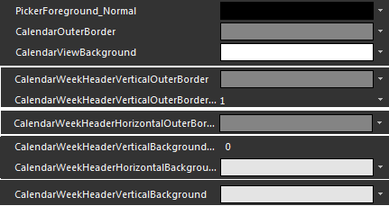
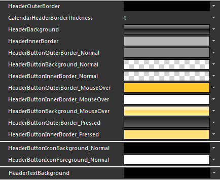
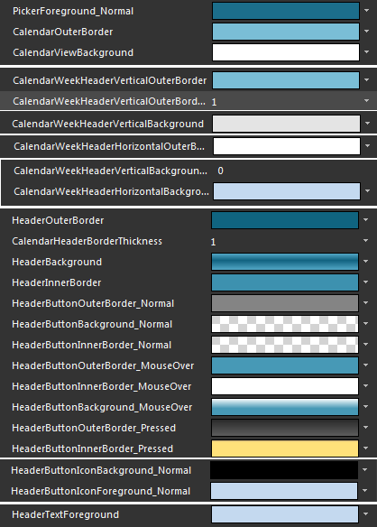
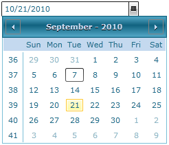

# Styling the Calendar

To style the calendar in your __RadDateTimePicker__ you can do the following:

* Create a __Style__ for it and set it to the __CalendarStyle__ property of the __RadDateTimePicker__. To learn how to create a style that targets the __RadCalendar__ control read [here]().

* Modify the default resources for the __RadCalendar__, that are generated together with the __RadDateTimePicker's Style__.

>tipTo learn how to generate the default __Style__ for the __RadDateTimePicker__ read [here](). To learn how to modify the layout of the clock, look [here]().

This topic will focus on the second approach.

## Modifying the default resources

In order to see these resources you have to first generate the default style for the __RadDateTimePicker__ control. To learn how read this [topic]().

Modifying some of the resources generated for the __RadDateTimePicker's__ style will allow you to change the appearance of the calendar. Here are some of the resources:

* __PickerForeground_Normal__ - is the foreground brush used in the __RadDateTimePicker__.

* __CalendarOuterBorder__ - is the calendar's content outer border brush which appears around the calendar view.

* __CalendarViewBackground__ - is the calendar view's background brush.

* __CalendarWeekHeaderVerticalOuterBorder__ - is the outer border brush used for the vertical line separating the week numbers from the dates in the calendar's month view.

* __CalendarWeekHeaderHorizontalOuterBorder__ - is the outer border brush used for the horizontal line separating the days' names from the dates in the calendar's month view.

* __CalendarWeekHeaderHorizontalBackground__ - is the background brush used in the calendar's month view, appearing behind the days of the week's names.

* __CalendarWeekHeaderVerticalBackground__ - is the background brush used in the calendar's month view, appearing behind the days of the week's names.

* __CalendarButtonButtonChromeMargin__ - is of type __Thickness__ and allows you to change the calendar view element's margin.

* __RadCalendarDefaultStyleKey__ - defines the calendar's default style.

The following resources describe the __RadDateTimePicker__ content's header:

* __HeaderOuterBorder__ - represents the __RadDateTimePicker__ content's header outer border brush.

* __HeaderBackground__ - corresponds to the __RadDateTimePicker__ content's header background.

* __HeaderInnerBorder__ - represents the __RadDateTimePicker__ content's header inner border brush.

* __HeaderTextBackground__ - is the foreground brush applied to the __RadDateTimePicker__ content's header.

* __MoveLeftButtonStyle__ - is the style applied to the header's left button.

* __MoveRightButtonStyle__ - is the style applied to the header's right button

* __CalendarHeaderButton__ - is the style applied to the header's main button.

In the Calendar view's header we can modify the default appearance of the left and right buttons. Each of them inherits a common __HeaderButtonChrome__ style, defining the following visual states:

* __Normal__ - is the normal state of the corresponding element.

* __MouseOver__ - is active when the mouse is over the corresponding visual element.

* __Pressed__ - is active when you press the corresponding visual element.

Each of the left and right buttons' default templates contain the following elements:

* __ButtonChrome__ - a __ButtonChrome__ which default style is __HeaderButtonChrome__ style.

* __BackgroundIcon__ - the background arrow pointing left or right.

* __ForegroundIcon__ - the foreground arrow pointing left or right.

For each of the described above common visual states, the following brushes are defined:

* __HeaderButtonOuterBorder__ - is the element's outer border when it is in the corresponding state (from those described above).

* __HeaderButtonInnerBorder__- is the element's inner border when it is in the corresponding state.

* __HeaderButtonBackground__ - is the element's background when it is in the corresponding state.

* __HeaderButtonIcon__ - defines the left and right icon's appearance through in the corresponding state (from those described above) including the __Disabled__ state.

Here is an example of the above resources modified:

Here is the result:

# See Also

 * [Styles and Templates - Overview]()

 * [Templates Structure]()

 * [Features - Date Items]()

 * [Styling RadDateTimePicker]()

 * [Styling the Clock]()
