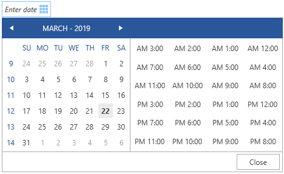
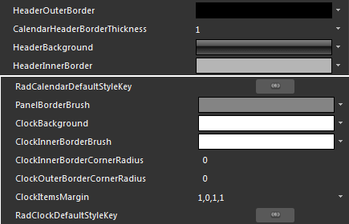
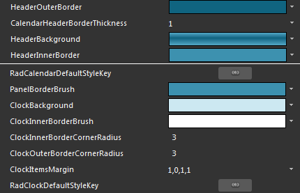
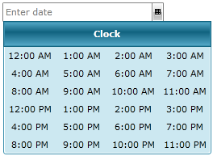

# Styling the Clock

To style the clock in your __RadDateTimePicker__ you can do the following:

* Create a __Style__ for it and set it to the __ClockStyle__ property of the __RadDateTimePicker__. 

* Modify the default resources for the __DateTimePickerClock__, that are generated together with the __RadDateTimePicker's Style__.

>tipTo learn how to generate the default __Style__ for the __RadDateTimePicker__ read [here](). To learn how to modify the layout of the calendar, look [here]().

## Setting the ClockStyle property

__Example 1__ demonstrates how the flow direction the __RadClock__ in the dropdown of the RadDateTimePicker can be switched:

__Example 1: RadDateTimePicker with ClockStyle__

```XAML
	<Window.Resources>
        <!-- If you are using the Xaml binaries, you do not have to set the BasedOn attribute-->
        
        <Style x:Key="ClockStyle" TargetType="telerik:RadClock" BasedOn="{StaticResource RadClockStyle}">
            <Setter Property="FlowDirection" Value="RightToLeft" />
        </Style>
    </Window.Resources>
    <Grid>
        <telerik:RadDateTimePicker VerticalAlignment="Center" HorizontalAlignment="Center"  ClockStyle="{StaticResource ClockStyle}" />
    </Grid>
```

#### __Figure 1: Result from Example 1 in the Office2016 theme__


## Modifying the default resources

In order to see these resource you have to first generate the default style for the __RadDateTimePicker__ control. To learn how read this [topic]().

Modifying some of the resources generated for the __RadDateTimePicker's__ style will allow you to change the appearance of the clock. Here are some of the resources:



* __HeaderOuterBorder__ - represents the __RadDateTimePicker__ content's header outer border brush.

* __CalendarHeaderBorderThickness__ - represents the described above border's thickness.

* __HeaderBackground__ - corresponds to the __RadDateTimePicker__ content's header background.

* __HeaderInnerBorder__ - represents the __RadDateTimePicker__ content's header inner border brush.

* __PanelBorderBrush__ - is the __BorderBrush__ used to outline the clock view.

* __ClockBackground__ - is the brush used as a background to the clock view.

* __ClockInnerBorderBrush__ - is the inner border brush applied to the clock view.

* __ClockInnerBorderCornerRadius__ - represents the inner border's corner radius of the __RadDateTimePicker's__ clock view.

* __ClockOuterBorderCornerRadius__ - represents the outer border's corner radius of the __RadDateTimePicker's__ clock view.

* __ClockItemsMargin__ - is the __Thickness__ applied to each item in the clock view.

* __RadClockDefaultStyleKey__ - defines the clock's default style which includes some of the above properties.

Here is an example of the above resources modified:



Here is the result:



## See Also

 * [Styles and Templates - Overview]()

 * [Features - Clock Items]()

 * [Styling RadDateTimePicker]()

 * [Styling the Calendar]()
