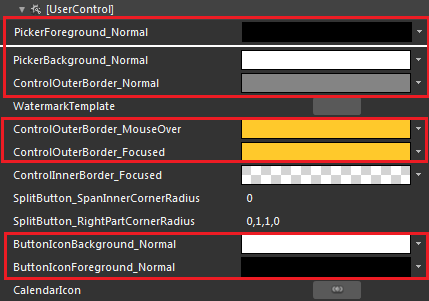
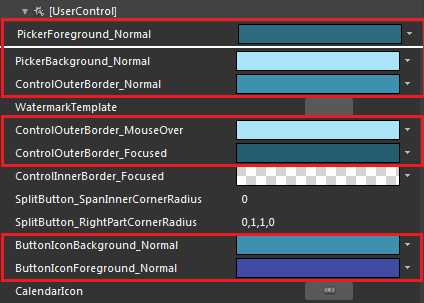
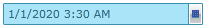

# Styling RadDateTimePicker

The __RadDateTimePicker__ can be styled by creating an appropriate __Style__ and setting it to the __Style__ property of the control. 

You have two options:

* To create an empty style and set it up on your own.

* To copy the default style of the control and modify it.

This topic will show you how to perform the second one.

## Modifying the Default Style

To copy the default style, load your project in Expression Blend and open the User Control that holds the __RadDateTimePicker__. In the 'Objects and Timeline' pane select the __RadDateTimePicker__ you want to style. From the menu choose Object -> Edit Style -> Edit a Copy. You will be prompted for the name of the style and where to be placed.

>tip If you choose to define the style in Application, it would be available for the entire application. This allows you to define a style only once and then reuse it where needed.

After clicking 'OK', Expression Blend will generate the default style of the __RadDateTimePicker__ control in the __Resources__ section of your User Control. The properties available for the style will be loaded in the 'Properties' pane and you will be able to modify their default values. You can also edit the generated XAML in the XAML View or in Visual Studio.

If you go to the __'Resources'__ pane, you will see an editable list of resources generated together with the style and used by it. In this list you will find the brushes, styles and templates needed to change the visual appearance of the __RadDateTimePicker__. Their names indicate to which part of the __RadDateTimePicker__ appearance they are assigned.

* __PickerForeground_Normal__ - is the foreground brush applied to the __RadDateTimePicker's__ input box.

* __PickerBackground_Normal__ - is the background  brush applied to the __RadDateTimePicker's__ input box.

* __WatermarkTemplate__ - defines the default template applied to the __RadDateTimePicker's__ watermark.

* __ControlOuterBorder_Normal__ - is the __RadDateTimePicker's__ input box control's outer border when it is in the normal visual state.

* __ControlOuterBorder_MouseOver__ - is the __RadDateTimePicker's__ input box control's outer border when the mouse is over it.

* __ControlOuterBorder_Focused__ - is the __RadDateTimePicker's__ input box control's outer border when it is focused.

The drop-down button's default template contains:

* __ButtonChrome__ - is the actual button you have to click on in order to show the pop up containing all the __RadDateTimePicker's__ content.

* __DropDownIcon__ - is of type __ContentControl__ and represents the net-like icon shown on the __RadDropDownButton__.

Regarding the __DropDownIcon__, you can modify the following resources:

* __CalendarIcon__ - defines the default __ControlTemplate__ used for the __DropDownIcon__. Its default template contains two paths:

	* __CalendarIconBackground__ - is the background path.

	* __CalendarIconForeground__ - is the foreground path.

* __ButtonIconBackground_Normal__ - is the background border brush applied to the CalendarIconBackground path.

* __ButtonIconForeground_Normal__ - is the foreground border brush applied to the CalendarIconBackground path.

>tip If you want to further modify the drop-down button's default appearance you can modify the default template applied to the __ButtonChrome__.

Here is an example of the above resources modified:

Here is the result:

## See Also

 * [Styles and Templates - Overview]()

 * [Styling the Calendar]()

 * [Styling the Clock]()