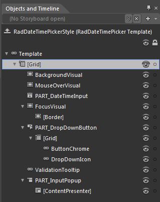
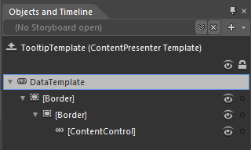
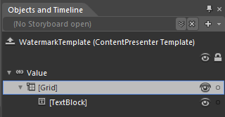

# Templates Structure

Like most controls, the __RadDateTimePicker__ also allows you to template it in order to change the control from the inside. Except for templating the whole control, you can template only parts of it. This topic will make you familiar with the structure of the __RadDateTimePicker's__ templates:

* [RadDateTimePicker Template Structure](#raddatetimepicker-template-structure)

* [Preview Tooltip Template Structure](#styling-template-structure#preview-tooltip-template-structure)

* [Watermark Template Structure](#watermark-template-structure)

>tipFor more information about templating and how to modify the default templates of the RadControls read the [Editing Control Templates]() topic on this matter.

## RadDateTimePicker Template Structure

* __[Grid]__  - is of type __Grid__ and hosts the __RadDateTimePicker's__ template.

* __BackgroundVisual__ - represents the __Border__ around the __RadDateTimePicker's__ input box.

* __MouseOverVisual__ -  represents the __Border__ used to highlight the control's input box in the mouse over visual state.

* __PART_DateTimeInput -__ represents the __RadDateTimePicker's__ user input box control and is of type __RadWatermarkTextBox__

* __FocusVisual__ - is of type Border and represents the control's outer border when it is focused.

* __[Border]__ - is of type Border and represents the control's inner border when it is focused.

* __PART_DropDownButton__ - represents the __RadDropDownButton__which shows the __RadDateTimePicker's__ content.

* __[Grid]__ - is of type __Grid__ and hosts the __RadDateTimePicker's__ content (the calendar and the clock views).

* __ButtonChrome__ - represents the drop-down button and is of type __Telerik.Windows.Controls.Chromes__.

* __DropDownIcon -__ represents the content inside the __DropDownButton__ and is of type __ContentControl__.

* __ValidationTooltip__ - represents the __RadDateTimePicker's__ validation tooltip visible when the control is in invalid and focused visual state. The __ValidationTooltip__ is of type __Telerik.Windows.Controls.Chromes__.

* __PART_InputPopup__ - represents the control showing the __RadDateTimePicker's__ Preview tooltip and is of type __Popup__.

* __[ContentPresenter]__ - represents the hosting control for the __RadDateTimePicker's__ Preview tooltip and is of type __ContentPresenter__.

## Preview Tooltip Template Structure

You can also modify the default template applied to the __RadDateTimePicker's__ Preview tooltip visual element.

* __[Border]__ - is of type __Border__ and represents the preview tooltip's outer border.

* __Border__ - is of type __Border__ and represents the preview tooltip's inner border.

* __ContentControl__ - is of type ContentControl and hosts the __RadDateTimePicker's__preview tooltip content.

## Watermark Template Structure

The __RadDateTimePicker's__default template also gives you a simple __WatermarkTemplate__ which you can further customize in order to meet your requirements.

* __[Grid]__ - hosts the __RadDateTimePicker's__ user input box content and is of type __Grid__.

* __[TextBlock]__ - represents the __RadDateTimePicker's__ watermark content.

# See Also

 * [Styles and Templates - Overview]()

 * [Visual Structure]()

 * [Templates Structure]()

 * [Styling RadDateTimePicker]()

 * [Styling the Calendar]()

 * [Styling the Clock]()
