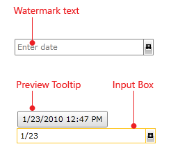
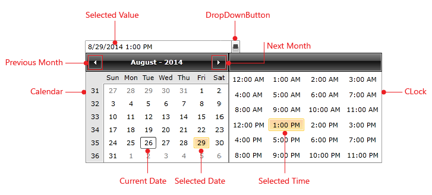

# Visual Structure

This section defines terms and concepts used in the scope of __RadDateTimePicker__ that you need to get familiar with prior to continue reading this help. They can also be helpful when contacting our support service in order to describe your issue better. Below you can see snapshots and explanations of the main states and visual elements of the standard __RadDateTimePicker__ control.        

The __RadDateTimePicker__ is a user interface control that presents users with an easy and user friendly way to choose a specific date, time or both. The contents can be shown and hidden as the user clicks on a dropdown button. In its default state, the content is collapsed, displaying only an input field as shown in the snapshot below. It is also possible to input data in the date time box by yourself, in which case a nice suggestive preview tooltip is available.        

When the drop down button is selected:

* __Watermark Text__ - is the text shown instead of the date and time when the __DateTimePicker__ is empty and is out of focus.

* __Calendar__ – is the __RadCalendar__ control holding the date items.

* __Clock__ – is the __DateTimePickerClock__ control holding the time items.

* __DropDownButton__ - is the __RadDropDownButton__ which shows or hides the __RadDateTimePicker__items. This element is always visible.

* __Preview ToolTip__ – is a __ContentControl__ which tries to guess your input, while the you are entering text in the control. Also it shows an error message when the __RadDateTimePicker__ is not able to parse the input text.

* __Input Box__– is the __RadWatermarkTextBox__ control showing the selected value and allowing you to enter date/time values.

# See Also

 * [Overview]()

 * [Getting Started]()

 * [Templates Structure]()
