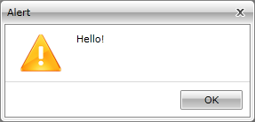
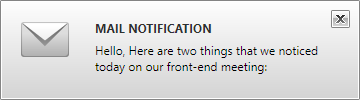

# Difference between RadDesktopAlert and RadAlert

In some cases you might get confused which control you need to use - __RadDesktopAlert__ or __RadAlert__. 

__RadAlert__ (Figure 1) is a modal dialog window that gets visualized during user interaction with the interface. It prevents the user from accessing the rest of the program's interface until it gets closed - the UI behind __RadAlert__ becomes inactive. 

__Figure 1:__ Alert

If you need to display a notification for a short period of time __RadDesktopAlert__ (Figure 2) is what you need. It is displayed as a small notification window on a predetermined location and gets automatically closed after the elapsing of specific duration.

__Figure 2:__ DesktopAlert

# See Also

 * [Overview]()

 * [Getting Started]()