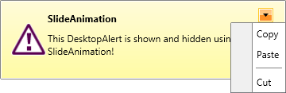

# MenuItemsSource 

With the Q3 2015 release version of UI for WPF the ability to place a DropDownButton with menu inside __RadDeskotopAlert__ next to the close button is now available. 

By default the button is not visible. In order to visualize it the __ShowMenuButton__ property needs to be set to true - its default value is false. As soon as the property gets set to true a DropDownButton with an empty menu will be visualized. 

You could populate the menu either using the __MenuItemsSource__ property or the __ItemContainerStyle__:

* [Using the MenuItemsSource](#using-the-menuitemssource)

* [Using the ItemContainerStyle](#using-menuitemcontainerstyle)

## Using the MenuItemsSource

In order to display items inside the menu using the __MenuItemsSource__ property of __RadDesktopAlert__ you need to set it with a collection of __DesktopAlertMenuItems__. The data that is displayed inside the menu of __RadDesktopAlert__ has a hierarchical structure – thus each item may come with a set of items on its own.

The DesktopAlertMenuItem is a class that contains the information for the menu items:
* __Header__ –it represents the header of the menu item.
* __IsSeparator__ – indicates whether the menu item is a separator.
* __IsCheckable__ – indicates whether the menu item could be checked.
* __IsChecked__ - indicates whether the menu item is checked.
* __IconUrl__ – represents the url of the image that represents the icon of the menu item.
* __Command__ - this is the command that will be executed when the command source gets invoked.
* __CommandParameter__ - a data defined by the user that could be passed to the command when it is executed.

So, in order to set the __MenuItemsSource__ a sample date needs to be created as shown below:

__Preparing the data__

```C#
	public static ObservableCollection<DesktopAlertMenuItem> GetDesktopAlertMenuItems()
	{
	    ObservableCollection<DesktopAlertMenuItem> items = new ObservableCollection<DesktopAlertMenuItem>();
	    DesktopAlertMenuItem copyItem = new DesktopAlertMenuItem()
	    {
	        Header = "Copy",
	    };
	    items.Add(copyItem);
	    DesktopAlertMenuItem pasteItem = new DesktopAlertMenuItem()
	    {
	        Header = "Paste",
	    };
	    items.Add(pasteItem);
	    DesktopAlertMenuItem separatorItem = new DesktopAlertMenuItem()
	    {
	        IsSeparator = true
	    };
	    items.Add(separatorItem);
	    DesktopAlertMenuItem cutItem = new DesktopAlertMenuItem()
	    {
	        Header = "Cut",
	    };
	    items.Add(cutItem);
	    return items;
	}
```

__Preparing the data__

```VB
	Public Function GetDesktopAlertMenuItems() As ObservableCollection(Of DesktopAlertMenuItem)
	    Dim items As New ObservableCollection(Of DesktopAlertMenuItem)()
	    Dim copyItem As New DesktopAlertMenuItem() With {.Header = "Copy"}
	    items.Add(copyItem)
	    Dim pasteItem As New DesktopAlertMenuItem() With {.Header = "Paste"}
	    items.Add(pasteItem)
	    Dim separatorItem As New DesktopAlertMenuItem() With {.IsSeparator = True}
	    items.Add(separatorItem)
	    Dim cutItem As New DesktopAlertMenuItem() With {.Header = "Cut"}
	    items.Add(cutItem)
	    Return items
	End Function
```

Finally, you need to pass the generated collection to the __MenuItemsSource__:

__Setting MenuItemsSource__

```C#
	alert.MenuItemsSource = GetDesktopAlertMenuItems();
```

__Setting MenuItemsSource__

```VB
	alert.MenuItemsSource = GetDesktopAlertMenuItems()
```

__Figure 2:__ RadDesktopAlert with set MenuItemsSource


## Using MenuItemContainerStyle

In order to visualize the data in the menu of __RadDeskotopAlert__ you could also use the __ItemContainerStyle__. The following sample Style could be used to visualize the data:

#### __XAML Setting MenuItemsSource___

```XAML
	<Style x:Key="DesktopAlertMenuItemContainerStyle" TargetType="telerik:RadMenuItem">
	    <Setter Property="Header" Value="{Binding Header}"/>
	    <Setter Property="Command" Value="{Binding Command}" />
	    <Setter Property="CommandParameter" Value="{Binding CommandParameter}" />
	    <Setter Property="IsSeparator" Value="{Binding IsSeparator}" />
	    <Setter Property="IsCheckable" Value="{Binding IsCheckable}" />
	    <Setter Property="IsChecked" Value="{Binding IsChecked}" />
	    <Setter Property="Icon" Value="{Binding IconUrl}" />
	    <Setter Property="IconTemplate">
	        <Setter.Value>
	            <DataTemplate>
	                <Image Source="{Binding}" Stretch="None"/>
	            </DataTemplate>
	        </Setter.Value>
	    </Setter>
	</Style>
```

In order to use the created style with __RadDeskotopAlert__ , you have to set its __MenuItemContainerStyle__ property.

__Setting MenuItemContainerStyle__

```C#
	var alert = new RadDesktopAlert();
	alert.ShowMenuButton = true;
	alert.MenuItemsSource = GetDesktopAlertMenuItems();
	alert.MenuItemContainerStyle = this.Resources["DesktopAlertMenuItemContainerStyle"] as Style;
```

__Setting MenuItemContainerStyle__

```VB
	Dim alert = New RadDesktopAlert()
	alert.ShowMenuButton = True
	alert.MenuItemsSource = GetDesktopAlertMenuItems()
	alert.MenuItemContainerStyle = TryCast(Me.Resources("DesktopAlertMenuItemContainerStyle"), Style)
```

## See Also

 * [Overview]()

 * [Getting Started]()