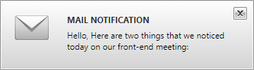

# Overview

Thank you for choosing Telerik __RadDesktopAlert__!

__RadDesktopAlert__ is a WPF control that allows you to display notifications on the desktop if a specific event occurs in your application - new e-mail message, meeting request or task request is received. It is displayed as a small popup on a predetermined location for a short period of time and gets automatically closed after the elapsing of that time. By using __RadDesktopAlertManager__ multiple alerts could easily be displayed and managed. The manager also takes care of the proper positioning of the alerts.

## Key Features

* __Different positioning__ -  __RadDesktopAlertManager__ supports displaying __RadDesktopAlert__ from multiple predefined positions of the primary screen. An offset to these positions can be applied for more precise positioning.

* __Multiple alerts__ - You can visualize unlimited number of __RadDesktopAlerts__ through a single __RadDesktopAlertManager__.

* __Animations__ - You are able to implement your custom animation for the showing and hiding of __RadDesktopAlert__.

* __Styling and Appearance__ - Provides an easy way to customize the appearance of the control.

* __Events__ - Support of routed events and some specific for the control events.

* __Command__ - __RadDesktopAlert__ allows you to register a custom command and pass a parameter to it.

You can check __RadDesktopAlert__ demos at: [http://demos.telerik.com/wpf](http://demos.telerik.com/wpf).

# See Also

 * [Getting Started]()

 * [Visual Structure]()
