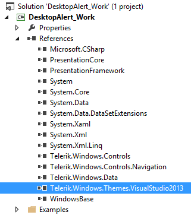
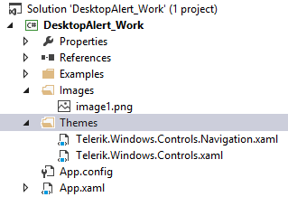
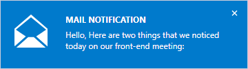

# Setting a Theme

The purpose of this article is to show you how to set a built-in theme to __RadDesktopAlert__.

>__RadDesktopAlert__ supports styling using __Implicit Styles__. Detailed information about the use of __Implicit Styles__ you could find [here]().

The following Xaml files should be merger in App.xaml file in order a theme to be correctly applied to the DesktopAlert:

* Telerik.Windows.Controls.xaml

* Telerik.Windows.Controls.Navigation.xaml

You could do that using one of the following approaches:

* Directly from the theme assembly: 

	For example let's apply VisualStudio2013 theme to __RadDesktopAlert__ - a reference to Telerik.Windows.Themes.VisualStudio2013.dll should be added as well:
	
	__Figure 1:__ Adding the needed references	
	
	
	After that merge the xaml files in the App.xaml as shown in __Example 1__:
	
	__Example 1: Merging the .xaml files__

	```XAML
		<ResourceDictionary>
		    <ResourceDictionary.MergedDictionaries>
		        <ResourceDictionary Source="/Telerik.Windows.Themes.VisualStudio2013;component/Themes/Telerik.Windows.Controls.xaml" />
		        <ResourceDictionary Source="/Telerik.Windows.Themes.VisualStudio2013;component/Themes/Telerik.Windows.Controls.Navigation.xaml" />
		    </ResourceDictionary.MergedDictionaries>
		</ResourceDictionary>
	```
	
* Add references to the required assemblies from Binaries.NoXaml folder. Create a Themes folder in your project that contains the corresponding .xaml files from Themes.Implicit/../VisualStudio2013/../Themes/ folder located in the installation folder:

	__Figure 2:__ Copying the .xaml files
	
	
	__Example 2__ shows how to merge the copied .xaml files.            

	__Example 2: Merging the .xaml files__

	```XAML
	<ResourceDictionary>
	    <ResourceDictionary.MergedDictionaries>
	        <ResourceDictionary Source="Themes/Telerik.Windows.Controls.xaml" />
	        <ResourceDictionary Source="Themes/Telerik.Windows.Controls.Navigation.xaml" />
	    </ResourceDictionary.MergedDictionaries>
	</ResourceDictionary>
```
	
Either way you choose, the end result will be the following:

__Figure 3:__ DesktopAlert with VisualStudio2013 theme applied


## See Also

 * [Getting Started]()

 * [Visual Structure]()