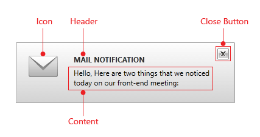

# Visual Structure

This article describes all the visual elements and terms used in __RadDesktopAlert__ control. 

* __Header__ - this is the header control of __RadDesktopAlert__. It is used to display textual information.

* __Content Area__ - this is the area inside __RadDesktopAlert__ where the content will be hosted. You could set it using the __Content__ property.

* __Close button__ - this button allows you to close __RadDesktopAlert__.

* __Icon__ - it represents the container for the icon image of __RadDesktopAlert__.

# See Also

 * [Overview]()

 * [Getting Started]()