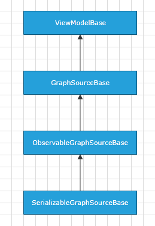

# DiagramExtensions ViewModels

Telerik Diagramming Framework provides a list of __ViewModels__ defined in the __Telerik.Windows.Controls.Diagrams.Extensions.dll__. 
		

## 

Please note that these classes are designed to serve as a base implementation of your __ViewModels__ thus facilitating your efforts when working with a data-bound __RadDiagram__. 
	  

This section provides information regarding these __ViewModels__. Below you can examine their inheritance model and find links to tutorials describing each class in more details:
		

ItemViewModels Inheritance Model
          

* [ItemViewModelBase]() - a __ViewModel__ designed to describe a few common properties of the __RadDiagramItems__.
			

* [NodeViewModelBase]() - a __ViewModel__ designed to describe a __RadDiagramShape__.
		  

* [LinkViewModelBase]() - a __ViewModel__ designed to describe a __RadDiagramConnection__.
			

* [ContainerNodeViewModelBase]() - a __ViewModel__ designed to describe a __RadDiagramContainerShape__.
			

* [HierarchicalNodeViewModel]() - a __ViewModel__ designed to describe a hierarchical __RadDiagramShape__.
			

GraphSource ViewModels Inheritance Model

* [GraphSourceBase]() - a __ViewModel__ designed to describe a sample __GraphSource__ implementation. Please note that this GraphSource type doesn't support TwoWay binding operation. This means that it shouldn't be used in __RadDiagram__ that has to provide any drag, drop or clipboard operations.
			

* [ObservableGraphSourceBase]() - a __ViewModel__ designed to describe a __GraphSource__ implementation that reflects the runtime changes in a __RadDiagram GraphSource__ collection. This makes the __ObservableGraphSourceBase__ class a good choice when creating a data-bound __RadDiagram__ that has to support drag and drop operations. However, it's important to create a custom class deriving from this built-in __ViewModel__ so that you can define how to implement the UI changes in the business logic.
			

* [SerializableGraphSourceBase]() - a __ViewModel__ designed to describe a __GraphSource__ implementation that supports all serialization operations in the __RadDiagram__. This makes the __SerializableGraphSourceBase__ class a good choice when creating a data-bound __RadDiagram__ that has to support clipboard operations. However please have in mind that the __SerializableGraphSourceBase__ is an __abstract__ class and therefore you need to create a custom class deriving from this built-in __ViewModel__.
			
