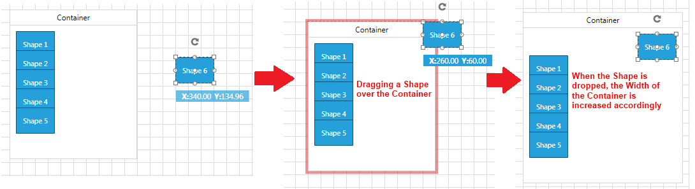
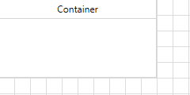
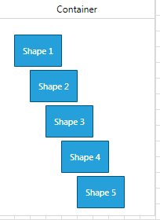
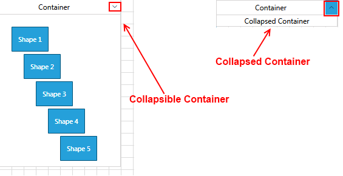

# ContainerShapes

This tutorial will walk you through the functionality and the main features of the RadDiagramContainerShape. 

## Overview

>Please note that the examples in this tutorial are showcasing Telerik Windows8 theme. In the[Setting a Theme](http://www.telerik.com/help/silverlight/common-styling-apperance-setting-theme.html#Setting_Application-Wide_Built-In_Theme_in_the_Code-Behind)[Setting a Theme](http://www.telerik.com/help/wpf/common-styling-apperance-setting-theme-wpf.html#Setting_Application-Wide_Built-In_Theme_in_the_Code-Behind) article you can find more information on how to set an application-wide theme.		  

The __RadDiagramContainerShape__ allows you to place multiple shapes into one container shape. The __RadDiagramContainerShapes__ are, much like [groups](), a way to logically combine other shapes but add to this the capability to have a visual wrapper including a header. You can drag shapes in and out of a __ContainerShape__ during runtime and take advantage of its built-in auto-sizing logic that can extend the size of a container to wrap a shape. The __Diagramming Framework__ provides a visual feedback when a shape is being dragged over a __RadDiagramContainerShape__ and even if part of the shape is outside the bounds of the container, the framework internally handles the drop and expands the size of the container to place the shape inside the content area of the container.		



>Please note the position and size of the containers takes into account the positions and sizes of all of its child shapes. In other words, even if fixed Position, Height and Width are set for the container, they will be coerced to cover all child shapes which is positioned outside the bounds of the container.

A container can be compared with a __HeaderedItemsControl__ but is also a true diagramming shape which can be connected and handled like other shapes. 		

>The __RadDiagramContainerShape__ derives from the __DiagramShapeBase__ class and this is why it exposes similar properties to those of the __RadDiagramShape__. To get familiar with the __RadDiagramShape__ features and properties, please refer to the [Diagram Shapes]() tutorial.		

## Setting a header

The __RadDiagramContainerShape__ header is controlled via the __Content__ property:

__Example 1: Specify container shape element in XAML__
```XAML
    <Grid>
        <telerik:RadDiagram>
            <telerik:RadDiagramContainerShape Content="Container" />
        </telerik:RadDiagram>
    </Grid>			  
```



If you bind the __Content__ property to a business property, you can use the __ContentTemplate__ to apply a __DataTemplate__ and control the way your business data is displayed in the header of the __RadDiagramContainerShape__:		  

__Example 2: Bind Content property of the container shape__
```XAML
    <Grid>
        <telerik:RadDiagram>
            <telerik:RadDiagramContainerShape Content="{Binding}">
                <telerik:RadDiagramContainerShape.ContentTemplate>
                    <DataTemplate>
                        <TextBlock Text="{Binding Header}" />
                    </DataTemplate>
                </telerik:RadDiagramContainerShape.ContentTemplate>
            </telerik:RadDiagramContainerShape>
        </telerik:RadDiagram>
    </Grid>
```

## Edit Mode

By default you can edit the header of the __RadDiagramContainerShape__ out-of-the-box by double-clicking on the container or by hitting F2. If you'd like to disable the editing functionality, you can set the __IsEditable__ property to __False__.

You can manually put the  __RadDiagramContainerShape__ in an edit mode by setting its __IsInEditMode__ property to __True__. This is the property that gets and sets the edit mode of the container.

## Populating with Items

The main purpose of the __RadDiagramContainerShape__ is to allow you to drop shapes on it thus grouping them in one container. This is why dragging and dropping shapes onto the container is the main approach for populating its __Items__collection. 

You can also populate it manually in xaml:
			
__Example 3: Declarativity populate container shape with items__
```XAML	
    <telerik:RadDiagram>
        <telerik:RadDiagramContainerShape  x:Name="containerShape" Content="Container">
            <telerik:RadDiagramShape Content="Shape1" />
        </telerik:RadDiagramContainerShape>
    </telerik:RadDiagram>	
```

Or in code-behind:

__Example 4: Populate container shape with items in code behind__
```C#
    containerShape.Items.Add(new RadDiagramShape() { Content = "Shape 1"});			  
```
```VB.NET
    containerShape.Items.Add(New RadDiagramShape() With {.Content = "Shape 1"})
```

You can also populate the __RadDiagramContainerShape__ from a collection of business items. You can use the __ItemsSource__ property to bind it to your data objects. For example, if the __RadDiagram.DataContext__ contains a collection of business nodes:	  

__Example 5: Create ViewModel which will hold custom collection of business objects__
```C#
    public class MainViewModel
    {
        public ObservableCollection<NodeViewModelBase> Nodes { get; set; }

        public MainViewModel()
        {
            this.Nodes = new ObservableCollection<NodeViewModelBase>();
            for (int i = 1; i < 6; i++)
            {
                this.Nodes.Add(new NodeViewModelBase()
                {
                    Content = String.Format("Shape {0}", i),
                    Position = new Point(i * 20, i * 45)
                });
            }
        }
    }

    public partial class ContainerShapeSample : UserControl
    {
        public ContainerShape()
        {
            InitializeComponent();
            this.xDiagram.DataContext = new MainViewModel();
        }
    }    
```
```VB.NET
    Public Class MainViewModel
        Public Property Nodes() As ObservableCollection(Of NodeViewModelBase)
            Get
                Return m_Nodes
            End Get
            Set
                m_Nodes = Value
            End Set
        End Property
        Private m_Nodes As ObservableCollection(Of NodeViewModelBase)

        Public Sub New()
            Me.Nodes = New ObservableCollection(Of NodeViewModelBase)()
            For i As Integer = 1 To 5
                Me.Nodes.Add(New NodeViewModelBase() With { .Content = [String].Format("Shape {0}", i), 
                                                            .Position = New Point(i * 20, i * 45)
                                                          })
            Next
        End Sub
    End Class

    Public Partial Class ContainerShapeSample
        Inherits UserControl
        Public Sub New()
            InitializeComponent()
            Me.xDiagram.DataContext = New MainViewModel()
        End Sub
    End Class
```

You can display that collection in a __RadDiagramContainerShape__:		  

__Example 6: Bind ItemsSource property of container shape__
```XAML
    <telerik:RadDiagram x:Name="xDiagram">
        <telerik:RadDiagram.ShapeStyle>
            <Style TargetType="telerik:RadDiagramShape">
                <Setter Property="Position" Value="{Binding Position, Mode=TwoWay}" />
            </Style>
        </telerik:RadDiagram.ShapeStyle>
        <telerik:RadDiagram.ShapeTemplate>
            <DataTemplate>
                <TextBlock Text="{Binding Content}" />
            </DataTemplate>
        </telerik:RadDiagram.ShapeTemplate>
        <telerik:RadDiagramContainerShape x:Name="cShape"
                                    Content="Container"
                                    ItemsSource="{Binding Nodes}" />
    </telerik:RadDiagram>			  			  
```



## Container Bounds

You can get the bounds of the __RadDiagramContainerShape__ through the __ContainerBounds__ property, which is of type __Rect__ and it gets the width, height and location of the container’s bounds.			

## Collapsible ContainerShapes

With Q2 2013, you can make your __RadDiagramContainerShape__ collapsible. In order to use such a container in your solution, you simply need to set the __IsCollapsible__ property of the container to __True__.		

For instance, if you take the above __RadDiagramContainerShape__ data-bound definition, you can extend it to set the __IsCollapsible__ property to __True__ in the following manner:	  

__Example 7: Set IsCollapsible in XAML__
```XAML
    <telerik:RadDiagram x:Name="xDiagram">
        <telerik:RadDiagram.ShapeStyle>
            <Style TargetType="telerik:RadDiagramShape">
                <Setter Property="Position" Value="{Binding Position, Mode=TwoWay}" />
            </Style>
        </telerik:RadDiagram.ShapeStyle>
        <telerik:RadDiagram.ShapeTemplate>
            <DataTemplate>
                <TextBlock Text="{Binding Content}" />
            </DataTemplate>
        </telerik:RadDiagram.ShapeTemplate>
        <telerik:RadDiagramContainerShape x:Name="cShape"
                                          Content="Container"
                                          IsCollapsible="True"
                                          ItemsSource="{Binding Nodes}" />
    </telerik:RadDiagram>		  
```

This should result in the following layout:


Below you can find a list of all __RadDiagramContainerShape__ members that are related to the collapsible feature of the shape:

* __IsCollapsible__: A property of type __bool__ that controls the collapsible state of a __RadDiagramContainerShape__.			

* __IsCollapsed__: A property of type __bool__ that controls whether a collapsible __RadDiagramContainerShape__ is currently collapsed.

* __CollapsedContent__: A property of type __object__ that gets or sets an __object__ that defines the content displayed inside a collapsed __RadDiagramContainerShape__.		  

__Example 8: Set CollapsedContent property in XAML__
```XAML
    <telerik:RadDiagram x:Name="xDiagram">
        <telerik:RadDiagram.ShapeStyle>
            <Style TargetType="telerik:RadDiagramShape">
                <Setter Property="Position" Value="{Binding Position, Mode=TwoWay}" />
            </Style>
        </telerik:RadDiagram.ShapeStyle>
        <telerik:RadDiagram.ShapeTemplate>
            <DataTemplate>
                <TextBlock Text="{Binding Content}" />
            </DataTemplate>
        </telerik:RadDiagram.ShapeTemplate>
        <telerik:RadDiagramContainerShape x:Name="cShape"
                                          Content="Container"
                                          CollapsedContent="Collapsed!"
                                          IsCollapsible="True"
                                          ItemsSource="{Binding Nodes}" />
    </telerik:RadDiagram>
```


* __CollapsedContentTemplate__: Gets or sets a __DataTemplate__ used to display the content inside a collapsed __RadDiagramContainerShape__.

* __IsCollapsedChanged__: An event that is raised by a __RadDiagramContainerShape__ to inform that the collapsed state of the shape is changed.

## Interaction

Below you can find a list of the interactions supported by the __RadDiagramContainerShape__: 

* __Rotation__: You can rotate only the __RadDiagramContainerShape__. This means that the rotation won't affect the container's children. You can find more information about shapes rotation in [this tutorial]().			

* __Translation__: You can translate the __ContainerShape__ along with its children.			

* __Scaling__: You can scale only the __ContainerShape__ without affecting its children scale. You can find more information about __RadDiagramItems__ resizing in [this tutorial]().			

* __Cut and Copy__: These clipboard operations work only on the __ContainerShape__. The shapes inside the container won't be cut or copied. You can find more information about the clipboard operations supported in the __RadDiagram__ in [this tutorial]().			

If you do wish to rotate, scale, cut or copy both the container and its children simultaneously, you can do so by dragging a selection rectangle around the container (instead of just clicking-selecting the container). This selection will contain both the container and the children thus allowing you to perform the aforementioned actions on all items at the same time.  

## Customize the ContainerShape Appearance

You can easily customize the visual appearance of the __RadDiagramContainerShape__ by using the following properties:		

* __Background__: Gets or sets the brush that specifies the __RadDiagramContainerShape__ background color.			

* __BorderBrush__: Gets or sets the brush that specifies the __RadDiagramContainerShape__ border color.			

* __BorderThickness__: Gets or sets the width of the __RadDiagramContainerShape__ outline.			

>tip You can use the __RadDiagram.ContainerShapeStyle__ property to explicitly apply a style on all __RadDiagramContainerShapes__ in a __RadDiagram__ instance.		  

## Container Service

The __ContainerService__ is a static class which can be used to manipulate the container shapes. This static class expose the following methods.

* __CompleteManipulation__: A void method that completes a given manipulation. Accepts a parameter of type __CompositeAsyncStateCommand__.
* __DetachItemsFromContainer__: A void method that detaches items from a container.
* __GetChildrenBounds__: This method returns a Rect element which wraps the items inside the container.
* __GetContainerChildrenRecursively__: This method searches recursively and returns all children of the container.
* __GetFloatingChildren__: This method returns all shapes and connections which are not attached to shapes.
* __GetParentContainersRecursively__: This method searches recursively and returns all parent containers.
* __GetRootItems__: A void method that returns all root containers if any exist. 
* __UpdateContainerLayout__: A void method that updates the container layout. Accepts a parameter of type __IDragDropAware__.

## Prevent Dropping Shape in Container

* __Prevent dropping a shape in container__: To prevent dropping a shape inside a container, you can set the __IsDropEnabled__ property of the __RadDiagramContainerShape__ to __False__.

__Example : Setting IsDropEnabled property to False__
```XAML
	<telerik:RadDiagramContainerShape IsDropEnabled="False" />
```

## Customize drag and drop actions

__RadDiagramContainerShape__ implements __IDragDropAware__ interface. This interface allows you to get notified when a shape is dragged over a container. The interface implements the following events and property:

* __IsDropPossible__: A property of type __bool__ that gets whether drag-drop items in this container is possible.
* __OnDragEnter__: This event is called when a dragged shape is over a container.
* __OnDragLeave__: This event is called when a dragged shape leave the boundary of the currently hover container.
* __OnDrop__: This event is called when a dragged shape is drop over a container.

To subscribe to the drag/drop events you can create a custom class which derives from __RadDiagramContainerShape__ and override the corresponding methods.

__Example : Overriding event handlers__
```C#
	public class CustomShape : RadDiagramContainerShape
	{
		protected override void OnDragEnter(DragItemsEventArgs args)
		{
			base.OnDragEnter(args);
		}
		protected override void OnDragLeave(DragItemsEventArgs args)
		{
			base.OnDragLeave(args);
		}
		protected override void OnDrop(DragItemsEventArgs args)
		{
			base.OnDrop(args);
		}
	}
```

## See Also
 * [Shapes]()
 * [Customize a ContainerShape]()
 * [Connections]()
 * [Custom Connectors]()
 * [Grouping]()
